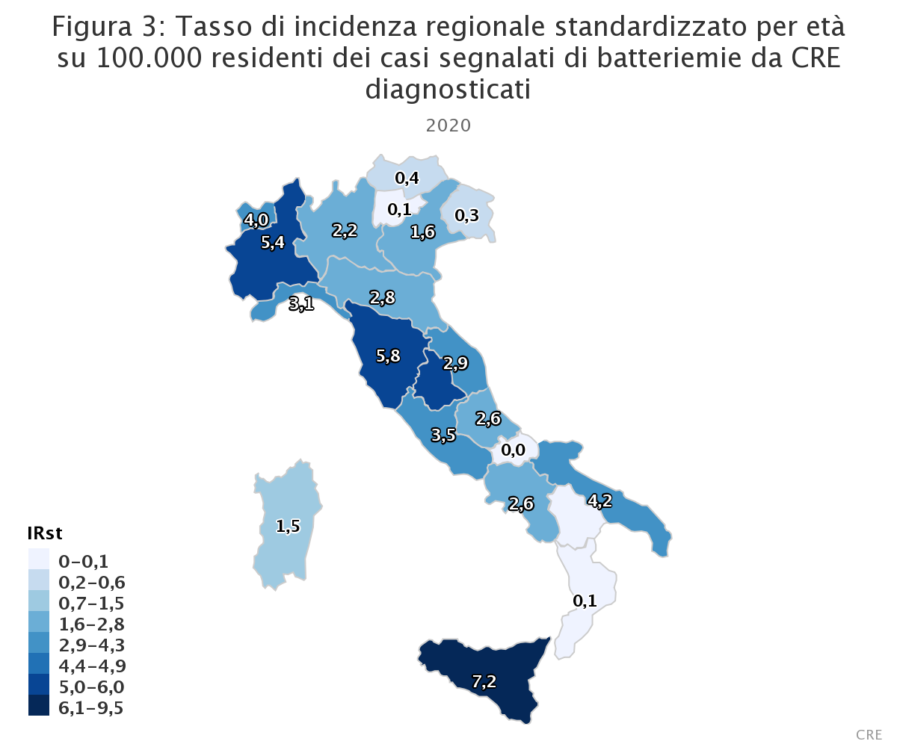

```{r setup, include=FALSE}
knitr::opts_chunk$set(echo = TRUE)
```

```{r xaringanExtra, echo=FALSE}
xaringanExtra::use_xaringan_extra(c("tile_view", "animate_css", "tachyons"))
```

<br>

## Overview

Until the 20th Century, influenza, pneumonia, tuberculosis, and diarrhea/enteric diseases were the top three causes of death in Western countries. The average life expectancy of adults was less than 50 years, and 2% of children failed to live beyond age 5 years. <br>

Industrialization and growing wealth in the 19th century brought improvements in sanitation and drinking water, leading to dramatic reductions in communicable enteric infections. By the early 20th century, vaccines for pertussis, tuberculosis, diptheria and yellow fever were being developed and tested in clinical trials. However, life-threating bacterial infections remained a common threat. Strep throat was sometimes a fatal disease, ear infections could lead deafness, mastoiditis or meningitis with a 90% mortality rate, and surgery or childbirth was much more dangerous.

<iframe src="https://ourworldindata.org/grapher/life-expectancy?tab=chart" loading="lazy" style="width: 100%; height: 600px; border: 0px none;">

</iframe>

Figure 1. Changes in life expectancy over 500 years

<br> The microbiologist and immunologist Paul Ehrlich (1854-1915) is generally credited with the first discovery of an antibiotic for the medical treatment of syphilis-arsphenamine or Salvarsan. The term "antibiotic" was later introduced by in 1943 by Selman Waksman-the discoverer of streptomycin. Erlich's approach of screening synthetic libraries of chemicals for selective antimicrobial properties was the basis of early antibiotic research and led to the discovery of the first sulfa antibiotics (e.g., sulfamidochrysoidine, sulfanilamide).

<br> However, it was the serendipitous discovery of penicillin on September 3, 1928 by Alexander Fleming and the subsequent purification of the drug in quantities needed for clinical testing by Florey and Chain in the late 1930s eventually led to mass production and distribution of penicillin by 1945- ushering in the modern antibiotic age. Alexander Fleming was also among the first to cautioned about the potential resistance to penicillin if used too little or for a too short of period during treatment.

> It is not difficult to make microbes resistant to penicillin in the laboratory by exposing them to concentrations not sufficient to kill them, and the same thing has occasionally happened in the body. The time may come when penicillin can be bought by anyone in the shops. Then there is the danger that the ignorant man may easily under-dose himself and by exposing his microbes to non-lethal quantities of the drug make them resistant. -Sir Alexander Fleming

<br> Indeed, Fleming's predictions were proven to be true within a couple of years, with the first case of penicillin resistance reported in 1947. Thus began an "arms race" between discovery or novel antibiotics and antimicrobial resistance.

<br>Although resistant infections were frequently encountered in the early days of antibiotic use, a flow of new antibiotics from 1950s-1980's provided alternative treatments. It was possible to simply switch treatment once resistance against a specific antibiotic became a major problem. But then the antibiotic discovery began to slow. The latest discovery of a new antibiotic class that has reached the market was in 1987. Since then, there has been a lack of innovation in the field, and today there are few novel antibiotic classes in the drug pipeline. In Module 2 we will scientific and market forces that have made new antibiotic discovery increasing difficult in both in both developed and low-middle-income countries (LMICs)

<br>Once a resistant bacterium has developed, it can spread from a colonised person to another person if appropriate hygienic precautions (e.g., hand hygiene, isolation) are not taken. The risk of resistant bacteria spreading is enhanced in crowded environments, especially when people in the surrounding area are receiving antibiotics - a common situation in hospitals and other healthcare facilities.

<br> The consequences of faltering antibiotic discovery are now seen worldwide as more and more bacterial infections are becoming hard to treat once again. Especially worrisome is the lack of antibiotics against Gram-negative bacteria. The rapid global spread of multi- and pan-resistant bacteria (also known in the lay press as "superbugs") can cause infections that are not treatable with existing antibiotics.


## Current situation

<br> Recognizing the growing global threat of antibiotic resistance (AMR) on human health but also the economy and human development, The World Health Organization (WHO) in 2017 developed a [Global Action Plan on AMR](https://www.who.int/publications/i/item/9789241509763). The global health plan outlines 21 strategies and 5 strategic objectives of a national action plans to addressing AMR.

1.  Improve awareness and understanding of antimicrobial resistance through effective communication, education and training
2.  Strengthen the knowledge and evidence base through surveillance and research
3.  Reduce the incidence of infection through effective sanitation, hygiene and infection prevention measures
4.  Optimize the use of antimicrobial medicines in human and animal health
5.  Develop the economic case for sustainable investment that takes account of the needs of all countries, and increase investment in new medicines, diagnostic tools, vaccines and other interventions

The WHO also published a [Priority Pathogen List](https://www.who.int/medicines/publications/WHO-PPL-Short_Summary_25Feb-ET_NM_WHO.pdf) for research and development of new antibiotics. This list is in addition to M*ycobacteria* (including *Mycobacterium tuberculosis,* the cause of human tuberculosis), which was globally established priority for which innovative new treatments are urgently needed The list breaks down pathogens into three priority groups:

<br>

+----------------+--------------------------------------------------------------------------------------------+
| Priority group | Pathogens included                                                                         |
+:===============+:===========================================================================================+
| Critical       | *Acinetobacter baumannii* (Carbapenem-resistant)                                           |
|                |                                                                                            |
|                | *Pseudomonas aeruginosa* (Carbapenem-resistant)                                            |
|                |                                                                                            |
|                | Enterbacterales (3rd generation cephalosporin, carbapenem-resistant)                       |
+----------------+--------------------------------------------------------------------------------------------+
| High           | *Enterococcus faecium*, vancomycin-resistant                                               |
|                |                                                                                            |
|                | *Staphylococcus aureus*, methicillin-resistant, vancomycin intermediate and resistant      |
|                |                                                                                            |
|                | *Helicobacter pylori*, clarithromycin-resistant                                            |
|                |                                                                                            |
|                | *Campylobacter*, fluoroquinolone-resistant                                                 |
|                |                                                                                            |
|                | *Salmonella* spp., fluoroquinolone-resistant                                               |
|                |                                                                                            |
|                | *Neisseria gonorrhoeae*, 3rd generation cephalosporin-resistant, fluoroquinolone-resistant |
+----------------+--------------------------------------------------------------------------------------------+
| Medium         | *Streptococcus pneumoniae*, penicillin-non-susceptible                                     |
|                |                                                                                            |
|                | *Haemophilus influenzae*, ampicillin-resistant                                             |
|                |                                                                                            |
|                | *Shigella* spp., fluoroquinolone-resistant                                                 |
+----------------+--------------------------------------------------------------------------------------------+

: Table 1. WHO antibiotic resistance priority pathogens list

## Situation in Italy

<br>Southern Europe, including Italy have among the highest resistance rates of WHO "critical pathogens". For example, surveillance data from the European Centres for Disease Control (ECDC) have documented a dramatic increase in carbapenem-resistance in Italy since 2009 with now more than one-third of *Klebsiella pneumoniae* resistant to previously-considered last-line antibiotics such as carbapenems. (see link to interactive resistance atlas [here)](https://atlas.ecdc.europa.eu/public/index.aspx?Dataset=27&HealthTopic=4) Similarly, the The Italian [Micronet Resistance Surveillance](https://www.epicentro.iss.it/antibiotico-resistenza/epidemiologia-italia) program reported that:

-   26.4% of *Escherichia coli* are resistant to 3rd generation cephalosporins
-   29.5% of *Klebsiella pneumoniae* are resistant to carbapenems (including 33.1% resistant to multiple drug classes)
-   15.9% of *Pseudomonas aeruginosa* are resistant to carbapenemase
-   80.8% of *Acinetobacter* spp. are resistant to carbapenems with 78.8% of species resistant to multiple drug classes
-   For *Staphylococcus aureus* , the percentage of methicillin-resistant isolates (MRSA) remained stable, around 34%, while a worrying trend continues to increase in the percentage of *Enterococcus faecium isolates* resistant to vancomycin, which in 2020 was equal at 23.6%
-   For *Streptococcus pneumoniae* there was a slight increase in both the percentage of isolates resistant to penicillin (13.6%) and those resistant to erythromycin (24.5%).
-   Higher resistance rates (around 40%) were observed in ICUs than in other wards for both carbapenem-resistant *K. pneumoniae* and methicillin-resistant *S. aureus*.

{width="800"}

In 2017, a [report](https://www.ecdc.europa.eu/en/publications-data/ecdc-country-visit-italy-discuss-antimicrobial-resistance-issues) by the the ECDC noted that the AMR situation in Italian hospitals and regions poses a major public health threat to the country. The levels of carbapenem-resistant Enterobacteriaceae (Enterobacterales) (CRE) and *Acinetobacter baumannii* have now reached hyper-endemic levels and, together with methicillin-resistant *Staphylococcus aureus* (MRSA), this situation causes Italy to be one of the Member States with the highest level of resistance in Europe. During conversations in Italy, ECDC often gained the impression that these high levels of AMR appear to be accepted by stakeholders throughout the healthcare system, as if they were an unavoidable state of affairs. The factors that contribute negatively to this situation seem to be:

-   Little sense of urgency about the current AMR situation from most stakeholders and a tendency by many stakeholders to avoid taking charge of the problem
-   Lack of institutional support at national, regional and local level
-   Lack of professional leadership at each level
-   Lack of accountability at each level
-   Lack of coordination of the activities between and within levels.

<br>

## The future

-   Drug-resistant diseases already cause at least 700,000 deaths globally a year, including 230,000 deaths from multidrug-resistant tuberculosis, a figure that could increase to 10 million deaths globally per year by 2050 under the most alarming scenario if no action is taken. Around 2.4 million people could die in high income countries between 2015 and 2050 without a sustained effort to contain antimicrobial resistance.
-   Increasing resistance will lead to an unthinkable future of untreatable infections, reversing more than a 100 years of medical progress. Routine medical procedures or surgery become much more dangerous. Lifesaving Immunosuppression, cancer chemotherapy and transplantations may become associated with unacceptable risk to the patient
-   Economic and social progress in many countries will be dramatically impacted leading to political and social instability. The economic damage of uncontrolled antimicrobial resistance could be comparable to the shocks experienced during the 2008-2009 global financial crisis as a result of dramatically increased health care expenditures; impact on food and feed production, trade and livelihoods; and increased poverty and inequality. The impact in LMIC will be even greater and longer lasting

## One-Health Perspective

Because the drivers of antimicrobial resistance lie in humans, animals, plants, food and the environment, a sustained One Health response is essential to engage and unite everyone around a shared vision and goals.

"One Health" refers to designing and implementing programmes, policies, legislation and research in a way that enables multiple sectors engaged in human, terrestrial and aquatic animal and plant health, food and feed production and the environment to communicate and work together to achieve better public health outcomes.

<br>

](onehealth.png)

### Veterinary use of antimicrobial therapy

-   75% if human infectious diseases that have emerged or re-emrged in recent decades are zoonotic-i.e. they orginated in animals [@WoolhouseGowtage-Sequeria2005].
-   Few antimicrobial classes are reserved exclusively for humans- (i.e. e.g., isoniazid used for tuberculosis) or drugs limited to veterinary use because of toxicity. The vast majority of antibiotics are used both in humans and animals, including domestic mammals, birds, farmed fish and shellfish, honeybees and others.
-   In horticulture, tetracyclines, streptomycin, and other antimicrobials are used for the prophylaxis and treatment of bacterial infections (e.g., fire blight *Erwinea amylovora*)
-   In veterinary medicine, major differences in the way antibiotics are used for companion animals (e.g., dogs, cats, pet birds, horses) versus food-producing animals- Antibiotic use in companion animals is broadly similar to humans to treat clinical infections or in select cases prophylaxis, such as post-surgery.
-   In the case of food animals, if some animals are infected antibiotics may be administered through feed or water to the entire group for reasons of practicality or efficiency. *Metaphylaxis* is a term used to describe therapeutic/prophylaxis treatment at a group level.
-   The most controversial type of group treatment in food animals is long-term, low-dose mass antibiotic treatment for purposes of growth promotion. This practice has a high propensity to select to antibiotic microbial resistance and is based on economic grounds rather than treatment of clinical infection.
-   The reported benefits of using antibiotics for growth promotion is low and ranges widely in the literature (1-10%). Concerns have been expressed that antimicrobial growth promoters are often used to compensate for poor hygiene/housing and healthy management.
-   The WHO has advocated for the termination of using antimicrobials for growth promotion.
-   In 2022, new [EU legislation](https://eur-lex.europa.eu/legal-content/EN/TXT/PDF/?uri=CELEX:32019R0006&from=EN) will prohibit all forms of routine antibiotic use in farming, including
    preventative group treatments and medicated feeding except in extraordinary circumstances.

### 

<iframe src="https://ourworldindata.org/grapher/antibiotic-use-in-livestock" loading="lazy" style="width: 100%; height: 600px; border: 0px none;">

</iframe>

### Case studies human-animal antimicrobial resistance

#### Case study 1

Third generation cephalosporins (ceftotaxime, ceftriaxone) are widely used for serious infections in humans, including urinary tract, abdominal, lung and bloodstream infections and are classified as "critically-important" for human health (WHO AGISAR). Cetiofur, cefpodoxime, and cefoperazone are 2nd and 3rd generation cephalosporins approved for veterinary use and predominantly for treating bacterial infections in food-producing animals including chickens and cattle.

Resistance to 3rd generation cephalosporins is mediated by extended-spectrum beta-lactamases (ESBLs) and AmpC. ESBL genese are highly mobile and transmitted on plasmids, transposons and other genetic elements horizontally and vertically. Resistance to 3rd generation cephalosporins is common among *Escherichia coli* and *Klebsiella pneumonia* requiring greater reliance on the few remaining classes of antimicrobials such as carbapenems.

A number of studies comparing isolates from animals, food and human infections have found a high similarity in ESBL genes and plasmids, as well as similar clonal isolates [@LazarusEtAl2015].

#### Case study 2

Figure 4. Antibiotic use in animals

-   (example of colistin stoppage in Vietman in chickens)

## LMICs

## Cross-Border Spread of Resistance

<br> European flight patterns, 2014 <video width="620" height="540" controls> <source src="Europe 24.mp4" type="video/mp4"> </video>

## References
