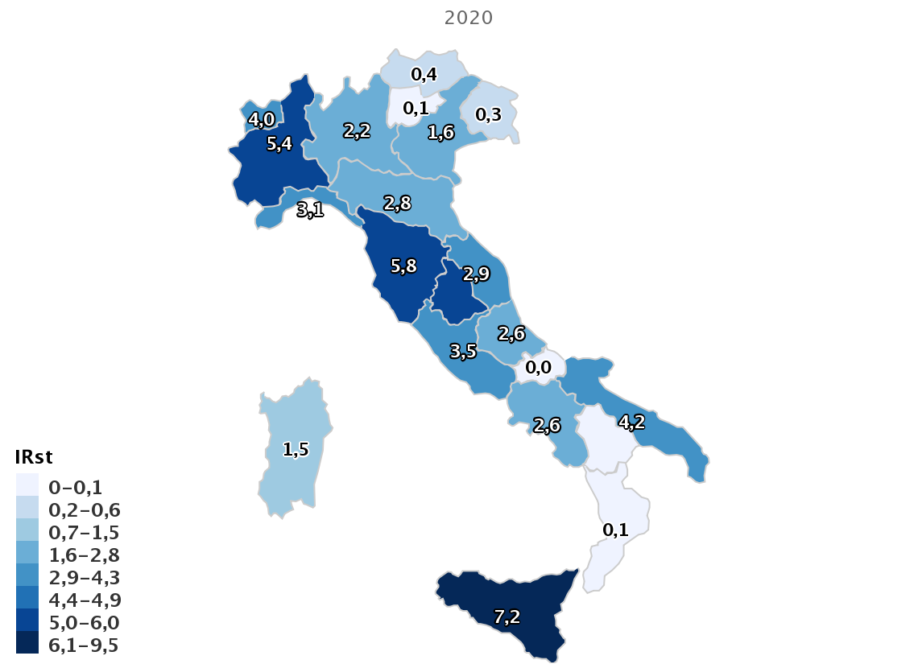

```{r setup, include=FALSE}
knitr::opts_chunk$set(echo = TRUE)
```

```{r xaringanExtra, echo=FALSE}
xaringanExtra::use_xaringan_extra(c("tile_view", "animate_css", "tachyons"))
```

<br>

# Global Management of AMR

Until the 20th Century, influenza, pneumonia, tuberculosis, and enteric infections were the top three causes of death in Western countries. The average life expectancy of adults was less than 50 years, and 2% of children failed to live beyond 5 years of age with most deaths caused by communicable diseases. <br>Industrialization and growing wealth during the 19th century brought improvements in sanitation and drinking water resulting in improvements in life expectancy. By the early 20th century, advances in immunization led to the introduction of vaccines for pertussis, diptheria, yellow fever and tuberculosis. However, life-threatening bacterial infections remained an everyday threat to human health. Strep throat was sometimes a fatal infection, ear infections could lead to deafness, mastoiditis or meningitis with a 90% mortality rate, and surgery or childbirth was associated with high complication rates and frequent maternal deaths.

<figure>

<iframe src="https://ourworldindata.org/grapher/life-expectancy?tab=chart" loading="lazy" style="width: 100%; height: 600px; border: 0px none;">

</iframe>

<figcaption>

Figure 1.1. Changes in life expectancy over 500 years. Data source: World Health Bank

</figcaption>

</figure>

<br>"Antibiotics" or products with antibiotic-like properties have been used for millennia to treat infections, although until the last century or so people did not know the infections were caused by bacteria. The first discovery and medical application of a synthetic drug for the treatment of bacterial infections is credited to Paul Erlich (1854-1915) for the use of arsphenamine (Salvarsan) in the treatment of syphilis. The serendipitous discovery of penicillin on September 3, 1928 by Alexander Fleming, and its subsequent purification of the drug in quantities needed for clinical testing by Florey and Chain in the late 1930s, however was the major breakthrough in antibiotic treatment for common infections. Alexander Fleming was also among the first physicians to caution about the risks of resistance to penicillin if used too little or for a too short of period during treatment.

> It is not difficult to make microbes resistant to penicillin in the laboratory by exposing them to concentrations not sufficient to kill them, and the same thing has occasionally happened in the body. The time may come when penicillin can be bought by anyone in the shops. Then there is the danger that the ignorant man may easily under-dose himself and by exposing his microbes to non-lethal quantities of the drug make them resistant. -Sir Alexander Fleming

<br> Fleming's predictions were realized within a couple of years as the first cases of penicillin resistance reported in 1947. Thus an "arms race" began between antimicrobial resistance and the discovery of new antibiotics to treat new forms of antibiotic resistance. Initially, during 1950s-1980's, antibioti discovery seemdd to keep pace with the emrgence of resistance. It was often possible to simply switch treatment once resistance against a specific antibiotic became a major problem. But then by the 1980's antibiotic discovery began to slow. The latest discovery of a new antibiotic class that has reached the market was in 1987. Since then, there has been a lack of innovation in the field, and today there are few novel antibiotic classes in the drug pipeline. In Module 2 we will examine the scientific challenges and market forces that have made new antibiotic discovery increasingly difficult.

<br> Once resistance has developed in a bacteria, it can spread from a colonised patient to another patient if appropriate hygienic precautions (e.g., hand hygiene, isolation) are not taken. The risk of resistant bacteria spreading is enhanced in crowded environments, especially when people in the surrounding area are receiving antibiotics - a common situation in hospitals and other healthcare facilities.

<br> The consequences of faltering antibiotic discovery are now seen worldwide as more and more bacterial infections are becoming hard to treat once again. Especially worrisome is the lack of antibiotics against Gram-negative bacteria. The rapid global spread of multi- and pan-resistant bacteria, also known in the lay press as "superbugs," can cause infections that are not treatable with existing antibiotics.

<center>

<figure>

</center>

{width="800"}
<figcaption>

Figure 1.2. Antibiotic discovery timeline

</figcaption>

</figure>

<br> Recognizing the growing global threat of antibiotic resistance (AMR) on human health but also the economy and human development, The World Health Organization (WHO) and World Organisation for Animal Health (OIE) proposed as a [Global Action Plan for AMR](https://www.who.int/publications/i/item/9789241509763) in 2017. The plan outlines 21 strategies and 5 strategic objectives action plans that should be implemented in member states to address AMR. These include

1.  Improvements in the awareness and understanding of antimicrobial resistance through effective communication, education and training
2.  Strengthening of knowledge and evidence base of AMR through surveillance and research
3.  Reductions in the incidence of infection through effective sanitation, hygiene and infection prevention measures
4.  Optimization the use of antimicrobial medicines in human and animal health
5.  Development of an economic case for sustainable investment in AMR research that takes account of the needs of all countries, and increase investment in new medicines, diagnostic tools, vaccines and other interventions

The WHO also published a [Priority Pathogen List](https://www.who.int/medicines/publications/WHO-PPL-Short_Summary_25Feb-ET_NM_WHO.pdf) for research and development of new antibiotics. This priority list includes bacterial pathogens that are considered to be be the biggest threat to human health beyond *Mycobacterium tuberculosis,*, which was previously listed as health priority pathogen for which innovative new treatments are urgently needed. The WHO list breaks down pathogens into three groups:

<br>

<figure>

<figcaption>

Table 1.1 WHO priority pathogens

</figcaption>
+----------------+--------------------------------------------------------------------------------------------+
| Priority group | Pathogens included                                                                         |
+:===============+:===========================================================================================+
| **Critical**   | *Acinetobacter baumannii* (Carbapenem-resistant)                                           |
|                |                                                                                            |
|                | *Pseudomonas aeruginosa* (Carbapenem-resistant)                                            |
|                |                                                                                            |
|                | Enterbacterales (3rd generation cephalosporin, carbapenem-resistant)                       |
+----------------+--------------------------------------------------------------------------------------------+
| **High**       | *Enterococcus faecium*, vancomycin-resistant                                               |
|                |                                                                                            |
|                | *Staphylococcus aureus*, methicillin-resistant, vancomycin intermediate and resistant      |
|                |                                                                                            |
|                | *Helicobacter pylori*, clarithromycin-resistant                                            |
|                |                                                                                            |
|                | *Campylobacter*, fluoroquinolone-resistant                                                 |
|                |                                                                                            |
|                | *Salmonella* spp., fluoroquinolone-resistant                                               |
|                |                                                                                            |
|                | *Neisseria gonorrhoeae*, 3rd generation cephalosporin-resistant, fluoroquinolone-resistant |
+----------------+--------------------------------------------------------------------------------------------+
| **Medium**     | *Streptococcus pneumoniae*, penicillin-non-susceptible                                     |
|                |                                                                                            |
|                | *Haemophilus influenzae*, ampicillin-resistant                                             |
|                |                                                                                            |
|                | *Shigella* spp., fluoroquinolone-resistant                                                 |
+----------------+--------------------------------------------------------------------------------------------+

</figure>

<br> These pathogens may exhibit multi-drug resistance (MDR, resistance to one agent in at least 3 antibiotic categories), extensive drug resistance (XDR, non-susceptibility except to 2 or fewer antibiotic categories) or pan-drug resistance (PDR, non-susceptibility to all agents in all antibiotic categories [@MagiorakosEtAl2012a]. Difficult-to-treat resistance (DTR) is a newer definition used to define isolate resistance patterns that require the use of less-effective or more toxic "reserve" agents- e.g., *Acinetobacter baumanii* susceptible only to colistin and tobramycin [@KadriEtAl2018a].

<br> Currently, both the [WHO](https://apps.who.int/iris/bitstream/handle/10665/312266/9789241515528-eng.pdf) and [OIE](https://www.oie.int/en/what-we-do/global-initiatives/antimicrobial-resistance/#ui-id-4) have developed and updated lists of critical importance for human and animal health.

## AMR situation in Italy

<br> Southern Europe, including Italy, has among the highest currently reported rates of resistance among pathogens included on the WHO Priority Pathogen list. For example, surveillance data from the European Centres for Disease Control (ECDC) have reported a dramatic increase in multidrug-resistance (MDR) in Italy since 2009, with now more than one-third of *Klebsiella pneumoniae* resistant to previously-considered last-line antibiotics such as carbapenems. (see link to interactive resistance atlas [here)](https://atlas.ecdc.europa.eu/public/index.aspx?Dataset=27&HealthTopic=4) Similarly, the The Italian [Micronet Resistance Surveillance](https://www.epicentro.iss.it/antibiotico-resistenza/epidemiologia-italia)) program has reported:

-   26.4% of *Escherichia coli* are resistant to 3rd generation cephalosporins
-   29.5% of *Klebsiella pneumoniae* are resistant to carbapenems (including 33.1% resistant to multiple drug classes)
-   15.9% of *Pseudomonas aeruginosa* are resistant to carbapenemase
-   80.8% of *Acinetobacter* spp. are resistant to carbapenems with 78.8% of species resistant to multiple drug classes
-   For the Gram-positive organism *Staphylococcus aureus*, the percentage of methicillin-resistant isolates (MRSA) remained stable, around 34%, while a worrying trend continues to increase in the percentage of *Enterococcus faecium isolates* resistant to vancomycin, which in 2020 was equal at 23.6%
-   For *Streptococcus pneumoniae* there was a slight increase in both the percentage of isolates resistant to penicillin (13.6%) and those resistant to erythromycin (24.5%).
-   Overall, higher antimicrobial resistance rates (around 40%) are observed in ICUs versus general medical wards for both carbapenem-resistant *K. pneumoniae* and methicillin-resistant *S. aureus*.

<center>

<figure>

{width="600"}

<figcaption>

Figure 1.3. Regional difference in carbapenem-resistant Enterobacterales (CRE) bloodstream infection- 2020 incidence per 100,000 residents in Italy
</figcaption>

</figure>

</center>

<br>

In 2017, a [report](https://www.ecdc.europa.eu/en/publications-data/ecdc-country-visit-italy-discuss-antimicrobial-resistance-issues) by the the ECDC noted that the AMR situation in Italian hospitals and regions poses a major public health threat to the country. The levels of carbapenem-resistant Enterobacteriaceae (Enterobacterales) (CRE) and *Acinetobacter baumannii* have now reached hyper-endemic levels in many hospitals. Together with increasing methicillin-resistance among the Gram-positive species *Staphylococcus aureus* (MRSA), these resistance trends has led to Italy's ranking as one of the Member States with one of the highest level of antibiotic resistance in Europe. Factors noted by the ECDC that contributed negatively to the poor control of antibiotic resistance in Italy include:

-   Little sense of urgency about the current AMR situation from most stakeholders and a tendency by many stakeholders to avoid taking charge of the problem
-   Lack of institutional support at national, regional and local level
-   Lack of professional leadership at each level
-   Lack of accountability at each level
-   Lack of coordination of the activities between and within levels.

<br>

## The future of AMR

-   Drug-resistant diseases already cause at least 700,000 deaths globally a year, including 230,000 deaths from multidrug-resistant tuberculosis. The estimated total number of deaths due to AMR could climb to 10 million deaths globally per year by 2050 under current projections.
-   Increasing resistance could lead to an unthinkable future of untreatable infections, reversing more than a 100 years of medical progress. Routine medical procedures or surgery will become much more dangerous and associated with higher complication rates. Immunosuppression, cancer chemotherapy and transplantations may cary unacceptable risk for many patients if infections cannot be effectively prevented and treated.
-   Economic and social progress in many countries will be dramatically impacted by increasing AMR leading to political and social instability. The initial short-term economic damage of uncontrolled antimicrobial resistance will be comparable to the shocks experienced during the 2008-2009 global financial crisis and result in dramatically-increased healthcare expenditures; reductions in food and feed production, reduced economic output, and [increased poverty and inequality](https://documents.worldbank.org/en/publication/documents-reports/documentdetail/323311493396993758/final-report). The economic impact of antimicrobial resistance is predicted to be even greater and longer lasting on low-and middle-income (LMIC) countries.

<figure>

<center>

{width="600"}

<figcaption>

Figure 1.4. Projected deaths due to antimicrobial resistance in 2050. Source: O'Neil Report [@ONeill2016].
</figcaption>

</center>

</figure>

<br>

## LMICs

<br>The real implications of spreading drug resistance will be felt the world over, with developing countries and large emerging nations bearing the brunt of this problem.

## One-Health Perspective

Because the drivers of antimicrobial resistance lie in humans, animals, plants, food and the environment, a sustained One Health response is essential to engage and unite everyone around a shared vision and goals. "One Health" refers to designing and implementing programmes, policies, legislation and research in a way that enables multiple sectors engaged in human, terrestrial and aquatic animal and plant health, food and feed production and the environment to communicate and work together to achieve better public health outcomes.

<br>

<center>

<figure>

{width="800"}

<figcaption>

Figure 1.5. Rationale for one-health model for addressing AMR: Source: WHO
</figcaption>

</center>

</figure>

### Antibiotic use in food production

-   75% if human infectious diseases that have emerged or re-emerged in recent decades are zoonotic-i.e. they originated in animals [@WoolhouseGowtage-Sequeria2005].
-   Few antimicrobial classes are reserved exclusively for humans. The vast majority of antibiotics are used both in humans and animals, including domestic mammals, birds, farmed fish and shellfish, honeybees and others.
-   In horticulture, tetracyclines, streptomycin, and other antimicrobials are used for the prophylaxis and treatment of bacterial infections (e.g., fire blight *Erwinea amylovora*)
-   In veterinary medicine, major differences in the way antibiotics are used for companion animals (e.g., dogs, cats, pet birds, horses) versus food-producing animals. Antibiotic use in companion animals is broadly similar to humans to treat clinical infections or in select cases prophylaxis, such as post-surgery. In the case of food animals, if some animals are infected antibiotics may be administered through feed or water to the entire group for reasons of practicality or efficiency. *Metaphylaxis is a term used to describe therapeutic/prophylaxis treatment at a group level.*
-   The most controversial type of group treatment in food animals is long-term, low-dose mass antibiotic treatment for purposes of growth promotion. This practice has a high propensity to select for antimicrobial resistance and is driven by economic factors rather than treatment of clinical infection.
-   The reported benefits of using antibiotics for growth promotion is controversial ranges widely in the literature (1-10%). Concerns have been expressed that antimicrobial growth promoters are often used to compensate for poor hygiene/housing and healthy management[@McEwenCollignon2018].
-   Historically, governmental regulations have focused on toxicological dose-response data and the presence of antimicrobial residues in tissue, milk or other edible products (i.e. eggs) from treated animals - *so called minimum residue levels (MRLs) compatible with acceptable risk in humans.* While MRLs are well-understood and enforced withtesting programs and penalties, these programs do not take into account selection of antimicrobial-resistant pathogens.
-   The WHO has advocated for the termination of using antimicrobials for growth promotion. A recent [report from the ECDC](https://www.ecdc.europa.eu/sites/default/files/documents/JIACRA-III-Antimicrobial-Consumption-and-Resistance-in-Bacteria-from-Humans-and-Animals.pdf) has suggested some progress. Using surveillance data from 2017, the EU/EEA population mean antibiotic consumption in the 29 countries was 130 mg per kg of estimated biomass in humans and 108.3 mg per kg in food-producing animals. *This first time since the agencies began publishing the joint reports in 2011 that antibiotic use in humans has exceeded use in livestock.* Consumption of third- and fourth-generation cephalosporins, fluoroquinolones, and aminopenicillins was considerably higher in human medicine, while consumption of macrolides was similar, and consumption of tetracyclines and polymyxins---a last-resort class of antibiotics that includes colistin---was significantly higher in food-producing animals.
-   In 2022, new [EU legislation](https://eur-lex.europa.eu/legal-content/EN/TXT/PDF/?uri=CELEX:32019R0006&from=EN) will prohibit all forms of routine antibiotic use in farming, including preventative group treatments and medicated feeding except in extraordinary circumstances.

<br>

<figure>

<iframe src="https://ourworldindata.org/grapher/antibiotic-use-in-livestock" loading="lazy" style="width: 100%; height: 800px; border: 0px none;">

</iframe>

<figcaption>

Figure 1.6. Antibiotic use in livestock reported in 2010
</figcaption>

</figure>

### Impacts on Human AMR

#### Case study-Cephalosporins

Third generation cephalosporins (ceftotaxime, ceftriaxone) are widely used for serious infections in humans, including the treatment of urinary tract, abdominal, lung and bloodstream infections. These antibiotics are classified as "critically-important" for human health ([WHO AGISAR](http://www.agisar.org/)). Cetiofur, cefpodoxime, and cefoperazone are similar cephalosporins approved veterinary antibiotics and used predominantly for treating bacterial infections in food-producing animals including chickens and cattle.

Resistance to 3rd generation cephalosporins is mediated by extended-spectrum beta-lactamases (ESBLs) and AmpC enzymes. ESBL genes are highly mobile and transmitted on plasmids, transposons and other genetic elements horizontally (to surrounding bacteria) and vertically (to daughter cells). The consequences are that resistance can spread rapidly from patient-to-patient and among different bacterial species. In recent years, growing resistance to 3rd generation cephalosporins is common among *Escherichia coli* and *Klebsiella pneumonia* has required greater reliance on the few remaining classes of antimicrobials such as carbapenems.

A number of studies comparing isolates from animals, food and human infections have found a high similarity in ESBL genes and plasmids, as well as similar clonal isolates [@LazarusEtAl2015].

Ceftiofur is frequently injected in small quantities to hatching eggs or chicks as metaphylaxis as prophylaxis against *Escherichia coli* infections and/or yolk sac infections [@McEwenCollignon2018]. This practice has been shown to select for cephalosporin resistance in *Salmonella enterica* serovar Heidelberg- an important cause of human illness in many countries that is typically associated with consumption of contaminated poultry products [@SmithEtAl2008a].

<br> Studies conducted by the Canadian Integrated Program for Antimicrobial Resistance Surveillance detected a high degree of temporal correlation in trends of resistance to ceftiofur (and ceftriaxone, a drug of choice for the treatment of severe cases of salmonellosis in children and pregnant women) among *Salmonella* Heidelberg from clinical infections in humans, from poultry samples collected at retail stores, and in *E. coli* from poultry samples collected at retail stores [@Canada2009]. Voluntary termination of ceftiofur metaphylaxis in hatcheries in the province of Quebec was followed by a precipitous drop in the prevalence of resistance to ceftiofur; subsequent reintroduction of ceftiofur in a more limited way was followed by a return to higher levels of resistance (Figure 7.)

<figure>

</figure>

<center>

{width="600"}

<figcaption>

Figure 1.7. Ceftiofur resistance in chicken and human *Salmonella* Heidelberg and chicken *E. coli*.
</figcaption>

</center>

</figure>

In Japan, voluntary withdrawal of the off-label use of ceftiofur in hatcheries in 2012 was also associated with significant decrease in broad-spectrum cephalosporin resistance in *E. coli* from chickens prepared for cooking. Some other countries (e.g., Denmark) have placed voluntary restrictions on its use. The label claim for day-old injection of poultry flocks was withdrawn in Europe, while some countries have banned off-label use of third-generation cephalosporins, and in other countries there is a requirement that use be restricted to situations where no other effective approved drugs are available for treatment.

This case study illustrates the danger of using antibiotics from the same class as critical therapies used to treat human infections for metaphylaxis or treatment in large numbers of animals. A similar pattern in poultry was also observed with mass medication of poultry flocks using fluoroquinolones antibiotics and selection of fluoroquinone- resistant *Campylobacter jejuni* infections in humans [@EndtzEtAl1991].

#### Case study- Colistin

<figure>

<center>

{width="600"}
<figcaption>

Figure 1.8. Chicken farm in the United States of America.

</figcaption>

</center>

</figure>

Colistin is a member of the polymixin class of antibiotics, which have been used in both human and veterinary medicine for over 50 years. Until relatively recently, polymixins were rarely prescribed beyond topical or inhalational therapy in rare cases because of dose-limiting neurotoxicity and nephrotoxicity of the drugs.

However, use of intravenous colistin has surged in the last decade with the increase in carbapenem-resistant *Pseudomonas aeruginosa*, *Acinetobacter baumannii* and *Klebsiella pneumoniae.* Even as human use has increased, colistin continues to be used in Brazil, Europe and China a a growth promoting and antibiotic treatment for pigs, poultry and calves.

-   In 2014, colistin use in EU member states in animals was higher than humans with a reported 485 tonnes- 99.7% in oral form or oral medicated feed [@EuropeanMedicinesAgency2016]. In China, with the world's largest production of pigs and poultry, an estimated 12,000 tonnes of colistin was used in the food production industry [@LiuEtAl2016a].

-   In 2015, Lui and colleagues reported plasmid-mediated colistin-resistance gene, *mcr-1*, in *Escherichia coli* isolates obtained from animals, food and human bloodstream infections in China [@LiuEtAl2016a]. Alarmingly, the resistance gene has also been detected in 5% of healthy travellers from China in other parts of the world [@zotero-7665].

-   The *mcr-1* gene has also been detected in isolates obtained from wildlife and surface water samples, demonstrating environmental contamination[@ZurfuhEtAl]

-   Additional plasmid-mediated colistin-resistance genes have been reported in many other bacterial species and countries, including *mcr-2* from pigs in Belgium, and *mcr-3,4,5* in other coutries[@BorowiakEtAl2017]

-   Colistin illustrates important *One-Health Dimensions* of AMR that differ from third generation cephaloporins. Specifically, large volumes of colistin use in animals, rather than humans, have probably have driven colistin resistance now observed in humans. Using large quantities of colistin for group treatment or growth promotion in animals has probably lead to antimicrobial resistance problems in human health, even through colistin was considered in the past to be less important because other less toxic treatments were still available.

<br>

<style>
div.blue { background-color:#e6f0ff; border-radius: 5px; padding: 20px;}
</style>
<div class = "blue">
**For further study:** In the 1990s avoparcin, a glycopeptide antimicrobial, was widely used in growth promotion in pigs and poultry production that was not initially thought to be of public health importance. Surveillance and research were eventually able to show that avoparcin use in animals contributed to the selection and wide dissemination of what type of resistance?
</div>

<br>

### Environmental concerns

One health considers possible environmental drivers of AMR in additional to human and animal health [@McEwenCollignon2018]. Some important resistant genes, such as beta-lactamases, are millions of years old. Soli and other environmental sources are rich sources of highly-diverse populations of bacteria and genes.

<br> Antimicrobial resistance to a wide variety of drugs has been demonstrated in environmental bacteria isolated from the preantibiotic era, as well as from various sites (e.g., caves) free of other sources of exposure to modern antimicrobials. Yet their is abundant evidence that human has an impact on the *resistome*- the totality of or resistance genes in the total environment [@ONeilJim2015].

<br> Hundreds of thousands of tonnes of antimicrobials are produced annually and find their way into the environment. Waste from treatment plants and the pharmaceutical industry especially if inadequately treated, has been show to release high concentrations of antimicrobials into surface water. Residues and metabolites of antimicrobials are constituents of human sewage, livestock manure, and aquaculture, along with fecal bacteria and resistance genes. Sewage treatment and composting of manure reduce concentrations of some but not all antimicrobials and microorganisms, which are introduced to soil upon land application of human and animal biosolids [@RahubeEtAl2016].

<br>In developed countries with good-quality sewage and drinking water treatment, and where most people have little to no direct contact with food-producing animals, transmission of bacteria and resistance genes from agricultural sources is largely foodborne, either from direct contamination of meat and poultry during slaughter and processing, or indirectly from fruit and vegetables contaminated by manure or irrigation water. In countries with poor sewage and water treatment, drinking water is likely to be very important in the transmission of resistant bacteria and/or genes from animals. Poor sanitation also facilitates indirect person-person waterborne transmission of enteric bacteria among residents as well as international travellers who return home colonized with resistant bacteria acquired locally. Through these and other means, including globalized trade in animals and food and long-distance migratory patterns of wildlife, antimicrobial-resistant bacteria are globally disseminated.

<br>General measures to address antimicrobial resistance in the wider environment include improved controls on pollution from industrial, residential, and agricultural sources. Improved research as well as environmental monitoring and risk assessment are also required to better understand the role of the environment in the selection and spread of antimicrobial resistance and to identify more specific measures to address resistance in this sector

</figure>

<center>

{width="800"}

<figcaption>

Figure 1.9. Hotspots of antimicrobial resistance

</figcaption>

</center>

</figure>

<br>

## International spread of AMR

<center>

{width="600"}
<figcaption>

Figure 1.9. World airline routes in 2014

</figcaption>

</center>

</figure>

</center>

## Summary

All healthcare professionals should have an understanding of the modifiable drivers of antimicrobial resistance and be motivated to reduce their impact on resistance selection and spread.

{width="800"}

# References
