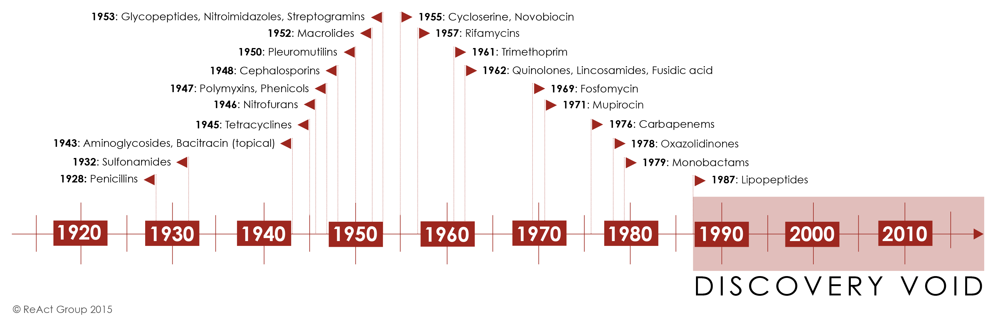

```{r setup, include=FALSE}
knitr::opts_chunk$set(echo = TRUE)
```

## A brief overview of antibiotic development {.unnumbered}

In module 1, we discussed the history of antibiotic discovery and the current challenges with antimicrobial resistance that have been amplified by the lack of development of new antibiotics. In this module, we will examine more closely the scientific and economic challenges associated with antibiotic development, and compare and contrat strategies that have been proposed to stimulate development of new antibiotics.

In Module 2 the student will study the current crises on antibiotic development, how markets, regulatory agencies, and clinical practice models impact antibiotic development, and then compare and contrast strategies that have been proposed to stimulate development of new antibiotics. Students will then participate in a simulation exercise where they will compare how incentive strategies may differ depending on the the type and expected use of a novel antibiotic.

{width="800"}

<figcaption>

**Figure 1. Antibiotic development timeline.** [Source ReACT Group 2015.](https://www.reactgroup.org/)

</figcaption>

</center>

</figure>

## 

## Communicating antimicrobial resistance {.unnumbered}

<figure>

<iframe src="https://www.youtube.com/watch?v=wTgRpOIxNG0" loading="lazy" style="width: 100%; height: 600px; border: 0px none;">

</iframe>

<figcaption>

**Figure 2. How to comunicate about antimicrobial resistance**. Data source: World Health Bank

</figcaption>

</figure>
