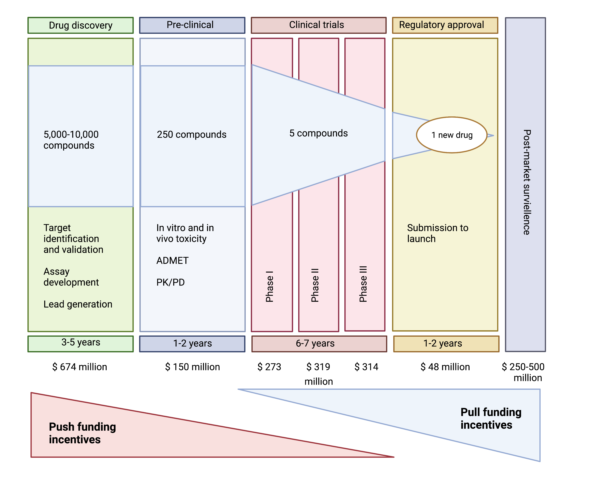

```{r setup, include=FALSE}
knitr::opts_chunk$set(echo = TRUE)
```

## The growing crises of antibiotic development {.unnumbered}

In module 1, we discussed the history of antibiotic discovery and the current challenges with antimicrobial resistance that has been amplified by the lack of development of new antibiotics. In this module, we will examine the scientific and economic challenges associated with antibiotic development, and compare and contrast strategies that have been proposed to stimulate development of new antibiotics.

As we discussed previously, antibiotic discovery began to slow in the 1980's leading to a discovery void in new molecular entities (NMEs) since the 1990s. This lack of antibiotic innovation occurred at a critical period when antibiotic resistance, particularly to many front-line beta-lactam antibiotics, began to increase rapidly due to the emergence and worldwide diffusion of new forms of enzymatic (beta-lactamase) resistance to antibiotics. These bacterial enzymes can be broadly classified as:

-   Narrow-spectrum beta-lactamases, which act on penicillins and first-generation cephalosporins (e.g., TEM-1 and 2, SHV-1, cephalosporinases, OXA-type enzymes
-   Extended-spectrum beta-lactamases (ESBLs), which act on penicillins and all four generations of cephalosporins (SHV-2, SHV-5, SHV-7, SHV-12, TEM-10, TEM-12, TEM-26, CTX-M, OXA-type ESBLs)
-   Carbapenemases, which act on penicillins, all four generations of cephalosporins, and carbapenems (KPC, NDM-1, VIM and IMP carbapenemases, OXA-type carbapenemases).

These beta-lactamases are problematic because they have a low barrier for creating resistance to multiple agents that are considered first and second line therapies of choice for common respiratory, abdominal, and genital-urinary tract infect infections. Indeed, single amino acid changes in the enzymes often can change their ability to hydrolyze new antibiotics. Additionally, many of these enzymes are encoded on spread on plasmids (mobile genetic elements that can be passed from one bacterial species to another) that harbour additional resistance mechanisms to other classes resulting in rapid dissemination of multidrug resistance.

<figure>

<center>

{width="600"}

<figcaption>

**Figure 1. Increase in numbers of group 1, 2, and 3 beta-lactamases from 1970 to 2009**. Figure is from Bush and Jacoby[@BushJacoby2010]

</figcaption>

</center>

</figure>

As discussed previously, the WHO in 2017 convened a group of experts to prioritize the need for new drugs to treat antibiotic- resistant bacteria. The WHO assigned the highest priority to antibacterial drug research and development for the Gram- negative bacteria *Acinetobacter*, *Pseudomonas* and species of *Enterobacterales* that are resistant to carbapenems and are usually extensively drug resistant (XDR).

**Table 1. WHO priority pathogens**

</figcaption>

+--------------+--------------------------------------------------------------------------------------------+
| Priority     | Pathogens included                                                                         |
+:=============+:===========================================================================================+
| **Critical** | *Acinetobacter baumannii* (Carbapenem-resistant)                                           |
|              |                                                                                            |
|              | *Pseudomonas aeruginosa* (Carbapenem-resistant)                                            |
|              |                                                                                            |
|              | Enterbacterales (3rd generation cephalosporin, carbapenem-resistant)                       |
+--------------+--------------------------------------------------------------------------------------------+
| **High**     | *Enterococcus faecium*, vancomycin-resistant                                               |
|              |                                                                                            |
|              | *Staphylococcus aureus*, methicillin-resistant, vancomycin intermediate and resistant      |
|              |                                                                                            |
|              | *Helicobacter pylori*, clarithromycin-resistant                                            |
|              |                                                                                            |
|              | *Campylobacter*, fluoroquinolone-resistant                                                 |
|              |                                                                                            |
|              | *Salmonella* spp., fluoroquinolone-resistant                                               |
|              |                                                                                            |
|              | *Neisseria gonorrhoeae*, 3rd generation cephalosporin-resistant, fluoroquinolone-resistant |
+--------------+--------------------------------------------------------------------------------------------+
| **Medium**   | *Streptococcus pneumoniae*, penicillin-non-susceptible                                     |
|              |                                                                                            |
|              | *Haemophilus influenzae*, ampicillin-resistant                                             |
|              |                                                                                            |
|              | *Shigella* spp., fluoroquinolone-resistant                                                 |
+--------------+--------------------------------------------------------------------------------------------+

<br>The same year, the WHO released a [clinical pipeline report](https://apps.who.int/iris/bitstream/handle/10665/330420/9789240000193-eng.pdf), which was updated in 2018 and 2019. The report analysed antibiotics and biologics in development according to their activity against the critical priority pathogens carbapenem resistant *Acinetobacter baumannii* (CRAB), carbapenem-resistant *Pseudomonas aeruginosa* (CRPA), extended spectrum beta-lactamase (ESBL) producing Enterobacterales and carbapenem resistant Enterobacterales (CRE). The level of innovation in the global clinical pipeline was assessed on the basis of the absence of pre-existing cross-resistance to currently used antibacterial drugs. The key findings from this report included:

<br>

> -   The clinical pipeline remains insufficient to tackle the challenge of increasing emergence and spread of antimicrobial resistance.
>
> -   It is primarily driven by small- or medium-sized enterprises (SMEs), with large pharmaceutical companies continuing to exit the field.
>
> -   Eight new antibacterial agents have been approved since 1 July 2017, but overall, they have limited clinical benefits.
>
> -   One new anti-tuberculosis (anti-TB) agent, pretomanid, developed by a not-for-profit organization, has been approved for use within a set drug-combination treatment for MDR TB.
>
> -   The current clinical pipeline contains 50 antibiotics and combinations (with a new therapeutic entity) and 10 biologicals, of which 32 antibiotics are active against the WHO priority pathogens:
>
>     -   Six of these agents fulfil at least one of the innovation criteria; only two of these are active against the critical MDR Gram-negative bacteria.
>
>     -   More than 40% of the pipeline targeting WHO priority pathogens consists of additional β-lactam and β-lactamase inhibitor (BLI) combinations, with a major gap in activity against metallo-βlactamase (MBL) producers.
>
>     -   The anti-TB and *Clostridium difficile* antibacterial pipeline is more innovative than the WHO priority pathogens pipeline, with more than half of the antibiotics fulfilling all of the innovation criteria.

The report confirms previous reports and highlights the public health implications of a drying antibiotic pipeline. In the following sections we will explore the causes and potential solutions to this crises.

## Why has antibiotic discovery faltered in recent years? {.unnumbered}

### Scientific challenges {.unnumbered}

Discovering new antibiotics is inherently challenging. Antibiotics must attack multiple target bacterial species that change over time, by developing resistance, and must attack these bacteria in multiple body compartments. [@LivermoreEtAl2011] The discoverer of a new antibiotic must guess what resistance problems will be a problem in 10 years, and bring drugs to market to overcome these challenges. This flexibility and risk is not encountered in other therapeutic areas such as hypertension, diabetes, hyperglycemia, or Alzheimer's disease where the drugs bind to one specific target. Even for cancer chemotherapy, which develops resistance to therapy, the mechanisms leading to resistance are not transmissible to other cancers or patients. Antibiotics must also be remarkabley non-toxic, as their daily dosages often measured in grams are often higher that for other pharmaceutics measured in milligrams.

Nearly all of the antibiotics used today belong to classes of drugs discovered before 1970. They are products of a "golden age" of antibiotic discovery from 1945-1965, which screened natural products from soil streptomyces and fungi. This discovery approach hit the law of diminishing returns by the 1960's with the same classes being repeatably rediscovered.[@LivermoreEtAl2011] Out simply, the *low-hanging* fruit for new antibiotic discovery has already been picked. Since 1970, the only new antibiotic classes to reach the marked are the oxazolidinones (i.e. linezolid discovered in 1978 launched in 2000) and lipopeptides (discovered in 1986 launched in 2003).

Most advances in antibiotics since the 1970s have come through improvements of existing antibiotic classes yielding analogues with increased potency and greater ability to evade existing resistance. However, over time this approach has become more difficult with the emergence of more potent resistance mechanisms that affects multiple antibiotics classes.

Given the the limits of existing antibiotic classes had already been discovered by screening soil organisms, the pharmaceutical industry turned to genomics-based high-throughput antibiotic discovery strategies with considerable enthusiasm in the 1990s.[@LivermoreEtAl2011] This discovery strategy used genomic sequence data from several target bacterial pathogens to identify conserved genes encoding targets not found in mammalian cells, and then run high-throughput inhibition screens of existing compound libraries to identify "druggable" molecules for these targets. During this time, traditional natural product screening was abandoned, partly because it had ceased to identify new leads, and was considered too expensive and time consuming and not easily adapted to the changing logistics of high-throughput drug screening.

Despite early enthusiasm and huge financial investments by many pharmaceutical companies, very few potential new antibiotic targets were identified and even fewer drugs entered into clinical development. An example of the scientific challenge is illustrated by experience of SmithKline Beecham (later purchased by Glaxo Smith Kline-one of the few large pharmaceutical companies still involved in antibiotic discovery (inset box). Indeed, only four major pharmaceutical companies still have active antibiotic research programmes.

### Antibiotic regulatory hurdles {.unnumbered}

The goal of regulatory bodies such as the U.S. Food and Drug Administration (FDA), the European Medicines Agency (EMA), and the African Medicines Agency (AMA) is to review the potential benefits and risks to ensure that new drugs that make it to market are both safe and effective for patients in need. Still, a drug that gains FDA approval may give pause to European reviewers, despite having reviewed the same evidence as their American counterparts, and vice versa. Both the [FDA](https://www.fda.gov/media/82381/download) and the [EMA](https://www.ema.europa.eu/en/documents/other/laboratory-patient-journey-centrally-authorised-medicine_en.pdf) and [AMA](https://www.ifpma.org/subtopics/african-medicines-agency/) have distinct processes with different methods of endpoint evaluation, and individual comfort levels with risk. Other countries, such as [India](https://cdsco.gov.in/opencms/opencms/en/Drugs/New-Drugs/) and [China](https://www.appliedclinicaltrialsonline.com/view/regulatory-requirements-and-key-points-drug-clinical-trials-registration-china) have their own processes for drug registration and approval and may require additional studies in populations of patients from their countries prior to approval. Therefore, if a new antibiotic that is effective for treating MDR pathogens is approved in one country, there is no guarantee that the drug will be favourable reviewed or avaiable in other countries.

Less than 10% of LMICs have access to "newely" approved antibiotics within 10 years of availability, due to low probability expectation [@KallbergEtAl2018]. However, even among HIC, patient access to new antibacterials is limited in countries such as Canada, Japan, and many European countries.[@OuttersonEtAl2021a]. Companies appear to eschew antibacterial markets not offering attractive commercial prospects, which are almost all markets currently. If truly innovative antibacterials, like those identified by WHO, cannot find profitable markets.

LMICs with limited drug regulatory capacity may loose control of antibiotic distribution. As a result, some antibiotics that should be reserved as last-line treatment options are sold without a prescription. Limited regulatory capacity may also lead to rampant availability of sub-standard and falsified antibiotic products, which further promote the emergence of antibiotic-resistant pathogens.

<figure>

<center>

{width="600"}

</center>

<figcaption>

**Figure 2. Pathway from drug discovery to regulatory approval and estimated costs.** ADMET- studies to document drug absorption, distribution, metabolism and elimination, and toxicity in animals. PK/PD pharmacokinetic/ pharmacodynamic relationships- i.e. dose response and toxicity relationships from animals.

</figcaption>

</figure>

Current guidance published by the US Food and Drug Administration (FDA) and the European Medicines Agency (EMA) requires randomized controlled clinical trals to demonstrate the non-inferiority of the new antibiotic to established therapies. This has to be complemented by the enrolment of a large number of patients to support the marketing application (New Drug Application NDA or Marketing Authorization Application MAA, respectively) for 1 or more infection site--specific indication (e.g., complicated urinary tract infection or complicated intra-abdominal infection), based on the drug's clinical efficacy and safety. The bacterial pathogens relevant to the indication listed in the prescribing information are a *secondary consideration* based on the spectrum of activity of the investigational antibiotic and the microbiological efficacy data extracted from the clinical trials.[@EcholsEtAl2019a] As a result, even if a new antibiotic is developed for a MDR pathogen, it is difficult to perform clinical studies and receive approval from the FDA or EMA for the treatment of a resistant infection.

A 2017 estimate puts the cost of developing an antibiotic at around US\$1.5 billion. Meanwhile, industry analysts estimate that the average revenue generated from an antibiotic's sale is roughly \$46 million per year.[@WoutersEtAl2020]. Therefore a key problem for antibiotics is that their development is not profitable. Companies are making more money from the sales of other drug classes, including immuno-oncology therapeutics, that antibiotic development projects compare poorly when management allocates capital. It is difficult for an antibiotic manufacturer to be able to precisely identify the small proportion of patients who both really need the antibiotic for a MDR pathogen and are willing to pay a high price for the drug. As noted by Ardal and colleges:[@ArdalEtAl2020a]

> The major challenge with antibiotics is profitability. As older antibiotics are still effective for treating most infections, the primary value of new antibiotics is to treat multidrug-resistant infections and provide a protective benefit against emerging pathogens. The duration of antibiotic treatment for individual patients is relatively short (for example, 1--2 weeks or up to 1 month), whereas the treatment for chronic conditions can be continuous over many years. Resistance is hastened by use, new antibiotics are stewarded as a last resort, which results in low unit sales. Whereas medicines for rare diseases have used high unit-pricing strategies to achieve profitability, these are often unavailable to antibiotic developers due to clinical trial design (it is difficult to demonstrate the superiority of new antibiotics as resistance is still relatively uncommon) and bundled hospital reimbursement structures (whereby hospitals are incentivized to prescribe lower-cost antibiotics). Large pharmaceutical companies have largely abandoned the market, accounting for only 4 of the 42 antibiotics currently under development.[@Mullard2019]Any investment in a new antibiotic is seen as a high-risk proposition, and consequently the returns expected by prospective investors are high to account for this risk premium. This in turn puts pressure on small and medium-sized enterprises (SMEs), as there is little chance that their candidate antibiotics will be purchased by larger companies.

<figure>

<center>

{width="600"}

</center>

<figcaption>

**Figure 3 Pathway from drug discovery to regulatory approval and estimated costs.** ADMET- studies to document drug absorption, distribution, metabolism and elimination, and toxicity in animals. PK/PD pharmacokinetic/ pharmacodynamic relationships- i.e. dose response and toxicity relationships from animals. Figure is from Ardal et al.[@ArdalEtAl2020a]

</figcaption>

</center>

Often under appreciated is the enormous costs that are incurred once an antibiotic is approved. Typically antibiotic approval is contingent on performing many studies post approval: pediatric studies, pharmacokinetic studies in special populations (i.e. elderly, obese, dialysis), pharmacovigelence (safety), development and validation of susceptibility testing technology, manufacturing and supply chain investments, and 5-10 years commitment to resistance surveillance studies to measure the ecological effects of antibiotics. While these enormous post-approval costs may be absorbable by large pharmaceutical companies with other profitable drug products, they can put smaller companies out of business especially if their approved drug was developed for MDR pathogens as the recent story of Archeogen demonstrates:

```{=html}
<style>
div.blue { background-color:#e6f0ff; border-radius: 5px; padding: 20px;}
</style>
```
::: blue
Achaogen first advanced plazomicin (Zemdri), a broad-spectrum aminoglycoside antibacterial, into the clinic in 2009. Despite initial plans to develop the drug as a much-needed new treatment for carbapenem-resistant Enterobacteriaceae (CRE) --- which included drug-resistant *Klebsiella* species and *Escherichia co*li --- a phase III trial that started in 2014 in this setting struggled to recruit patients. The company pivoted to initiate a phase III trial in complicated urinary tract infections (cUTIs) in 2016, and submitted the drug for FDA approval in this indication and in blood stream infections in 2017. Although the agency approved the drug for cUTI in 2018, they rejected its use in the potentially more lucrative and important blood stream infections. An independent advisory committee also voted against approval in the bloodstream, noting that the efficacy signal came from a small study of just 28 patients. In the end, It spent 15 years and a billion dollars to win FDA approval for Zemdri, a drug for hard-to-treat UTs. In July, the World Health Organization added plazomicin to its [list of essential new medicines](https://www.who.int/medicines/publications/essentialmedicines/en/). Achaogen later filed for bankruptcy, less than a year after the FDA approved its lead product. See: [Crises Looms in Antibiotics as Drug Makers Go Bankrupt](https://www.nytimes.com/2019/12/25/health/antibiotics-new-resistance.html). NY Times, December 25, 2019.
:::

</figure>

Even if the resources are found to bring an innovative antibiotic for resistant pathogens is successfully brought to market, many countries and health systems will negotiate the lowest possible price for purchase and then (appropriately) restrict the use of the antibiotic to preserve its effectiveness- resulting in low sales. This is completely different from a scenario of a new "breakthrough" cancer therapy, where the drug will be immediately incorporated in treatment

## What are the current strategies to incentive antibiotic development? {.unnumbered}

Incentives for antibiotics are categorized as either 'push' or 'pull'. Push incentives occur before regulatory approval by the FDA or European Medicines Agency, and the funding supports many projects, including the many that fail before approval. Pull incentives are paid only after regulatory approval and hence only successful products are supported. Both push and pull incentives are required to address our pressing problems.

Many successful initiatives to establish push funding for antibiotics have been developed over the last decade including but not limited to:

-   [Innovative Medicines Initiative](https://www.imi.europa.eu/projects-results/project-factsheets/nd4bb) New Drugs for Bad Bugs (launched in 2012; funds made available €223 million
-   [CARB-X](https://carb-x.org/) (launched in 2016; funds made available US\$455 million)
-   [Novo Holdings REPAIR Impact Fund](https://www.repair-impact-fund.com/) (launched in 2018; funds made available US\$165 million).
-   [Global Antibiotics Research and Development Partnership](https://www.gardp.org/). GARDP . Funded by over 60 partners in 20 countries. Seeking 500 million dollars to develop 5 new antibiotics by 2025.
-   [European Gram Negative AntiBacterial Engine (ENABLE)](https://www.imi.europa.eu/projects-results/project-factsheets/enable)

<figure>

<center>

{width="800"}

</center>

<figcaption>

**Figure 3. Push versus pull incentives for antibiotic development.**

</figcaption>

</figure>

However, as the Achaogen story illustrates, pull funding may be the greatest challenge. Pull incentives are being actively discussed in the United States and Europe, building on the release of the DRIVE-AB final report in 2018. One of the strategies that has garnered the most attention is the the "Netflix reinbursement model" that is be implemented in a selected approach in the [UK](https://www.gov.uk/government/news/world-first-scheme-underway-to-tackle-amr-and-protect-uk-patients) and [Sweden](https://www.folkhalsomyndigheten.se/the-public-health-agency-of-sweden/communicable-disease-control/antibiotics-and-antimicrobial-resistance/availability-of-antibiotics/).

<figure>

<iframe src="https://www.ft.com/video/adada10f-5747-4976-a3e0-958b0165e0ef" loading="lazy" style="width: 100%; height: 600px; border: 0px none;">

</iframe>

<figcaption>

**Figure 4. The "Netlfix Model" of Pull Incentives for antibiotic development and reinbursement..**

</figcaption>

</figure>

What strategies can be used to ensure global access to future antibiotics?

Netflix model for antibiotics?

<figure>

<iframe src="https://www.ft.com/video/adada10f-5747-4976-a3e0-958b0165e0ef" loading="lazy" style="width: 100%; height: 600px; border: 0px none;">

</iframe>

<figcaption>

**Figure 4. Changes in life expectancy over 500 years**. Data source: World Health Bank

</figcaption>

</figure>

### Economic strategies? {.unnumbered}

Incentives for antibiotics are categorized as either 'push' or 'pull'. Push incentives occur before regulatory approval by the FDA or European Medicines Agency, and the funding supports many projects, including the many that fail before approval. Pull incentives are paid only after regulatory approval and hence only successful products are supported. Both push and pull incentives are required to address our pressing problems.
