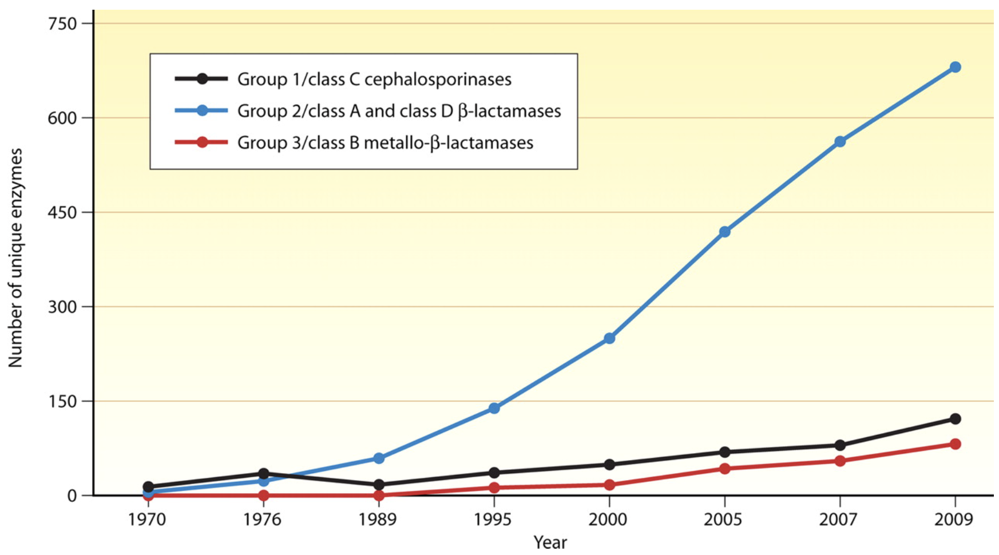

```{r setup, include=FALSE}
knitr::opts_chunk$set(echo = TRUE)
```

## The growing crises of antibiotic development {.unnumbered}

In module 1, we discussed the history of antibiotic discovery and the current challenges with antimicrobial resistance that has been amplified by the lack of development of new antibiotics. In this module, we will examine the scientific and economic challenges associated with antibiotic development, and compare and contrast strategies that have been proposed to stimulate development of new antibiotics.

As we discussed previously, antibiotic discovery began to slow in the 1980's leading to a discovery void in new molecular entities (NMEs) since the 1990s. This lack of antibiotic innovation occurred at a critical period when antibiotic resistance, particularly to many front-line beta-lactam antibiotics began to increase rapidly due to the emergence and worldwide diffusion of new forms of enzymatic (beta-lactamase) resistance to antibiotics. These bacterial enzymes can be broadly classified as:

-   Narrow-spectrum beta-lactamases, which act on penicillins and first-generation cephalosporins (e.g., TEM-1 and 2, SHV-1, cephalosporinases, OXA-type enzymes
-   Extended-spectrum beta-lactamases (ESBLs), which act on penicillins and all four generations of cephalosporins (SHV-2, SHV-5, SHV-7, SHV-12, TEM-10, TEM-12, TEM-26, CTX-M, OXA-type ESBLs)
-   Carbapenemases, which act on penicillins, all four generations of cephalosporins, and carbapenems (KPC, NDM-1, VIM and IMP carbapenemases, OXA-type carbapenemases).

These beta-lactamases are problematic because they have a low barrier for creating resistance to multiple agents that are considered first and second line therapies of choice for common infection. Indeed, often a single amino acid changes in the enzymes can change their ability to hydrolyze new antibiotics. Additionally, many of these enzymes are encoded on spread on plasmids (mobile genetic elements that can be passed from one bacterial species to another) resulting in rapid dissemination of resistance.

<figure>

<center>

{width="800"}

<figcaption>

**Figure 1. Increase in numbers of group 1, 2, and 3 beta-lactamases from 1970 to 2009**. Figure is from Bush and Jacoby[@BushJacoby2010]

</figcaption>

</center>

</figure>

A major concern is the increase in carbapenem-resistant Gram-negative pathogens encoded by a range of genes, including NDM-1, OXA-48, KPC, VIM, and IMP. Resistance has rapidly spread globally and across bacterial species since the first reported case in *Klebsiella pneumoniae* less 6 than a decade ago. The emergence of plasmid-mediated genes (*mcr*-1, *mcr*-2, *mcr*-3, *mcr*-4, *mcr*-5, 7 and *icr*-Mo ), which encode resistance to colistin- a drug of last resort, was first reported in 2016 from *Escherichia coli* cultured from a pig in China, but it has since been reported globally and in numerous bacterial species, including *K. pneumoniae* and *Enterobacter* species. Additionally, multiple variants of genes encoding extended-spectrum beta-lactamase (ESBL) and conferring resistance to penicillin, cephalosporins, and monobactam have now spread globally.

Reports from major surveillance networks, including [EARS-Net in Europe](https://atlas.ecdc.europa.eu/public/index.aspx), indicate high prevalence in *E. coli* and *K. pneumoniae*. ESBL-positive Gram-negative bacteria are found in livestock, meat products, and companion animals. In *Neisseria gonorrhoeae*, resistance to the recommended first-line therapy (azithromycin and ceftriaxone) has been reported in the United Kingdom and Australia with the UK isolate showing resistance for all currently recommend antibiotics.

In early 2017, the WHO convened a group of experts to prioritize the need for new drugs to treat antibiotic- resistant bacteria. The WHO assigned the highest priority to antibacterial drug research and development for the Gram- negative bacteria *Acinetobacter*, *Pseudomonas* and species of *Enterobacterales* that are resistant to carbapenems and are usually extensively drug resistant (XDR).

**Table 1. WHO priority pathogens**

</figcaption>

+--------------+--------------------------------------------------------------------------------------------+
| Priority     | Pathogens included                                                                         |
+:=============+:===========================================================================================+
| **Critical** | *Acinetobacter baumannii* (Carbapenem-resistant)                                           |
|              |                                                                                            |
|              | *Pseudomonas aeruginosa* (Carbapenem-resistant)                                            |
|              |                                                                                            |
|              | Enterbacterales (3rd generation cephalosporin, carbapenem-resistant)                       |
+--------------+--------------------------------------------------------------------------------------------+
| **High**     | *Enterococcus faecium*, vancomycin-resistant                                               |
|              |                                                                                            |
|              | *Staphylococcus aureus*, methicillin-resistant, vancomycin intermediate and resistant      |
|              |                                                                                            |
|              | *Helicobacter pylori*, clarithromycin-resistant                                            |
|              |                                                                                            |
|              | *Campylobacter*, fluoroquinolone-resistant                                                 |
|              |                                                                                            |
|              | *Salmonella* spp., fluoroquinolone-resistant                                               |
|              |                                                                                            |
|              | *Neisseria gonorrhoeae*, 3rd generation cephalosporin-resistant, fluoroquinolone-resistant |
+--------------+--------------------------------------------------------------------------------------------+
| **Medium**   | *Streptococcus pneumoniae*, penicillin-non-susceptible                                     |
|              |                                                                                            |
|              | *Haemophilus influenzae*, ampicillin-resistant                                             |
|              |                                                                                            |
|              | *Shigella* spp., fluoroquinolone-resistant                                                 |
+--------------+--------------------------------------------------------------------------------------------+

The same year, the WHO released a [clinical pipeline report](https://apps.who.int/iris/bitstream/handle/10665/330420/9789240000193-eng.pdf), which was updated in 2018 and 2019 The clinical pipeline reports analysed antibiotics and biologics according to their activity against the critical priority pathogens carbapenem resistant *Acinetobacter baumannii* (CRAB), carbapenem-resistant *Pseudomonas aeruginosa* (CRPA), extended spectrum beta-lactamase (ESBL) producing Enterobacterales and carbapenem resistant Enterobacterales (CRE). The level of innovation in the global clinical pipeline was assessed on the basis of the absence of pre-existing cross-resistance to currently used antibacterial drugs. The key findings from this report included:

> -   The clinical pipeline remains insufficient to tackle the challenge of increasing emergence and spread of antimicrobial resistance.
>
> -   It is primarily driven by small- or medium-sized enterprises (SMEs), with large pharmaceutical companies continuing to exit the field.
>
> -   Eight new antibacterial agents have been approved since 1 July 2017, but overall, they have limited clinical benefits.
>
> -   One new anti-tuberculosis (anti-TB) agent, pretomanid, developed by a not-for-profit organization, has been approved for use within a set drug-combination treatment for MDR TB.
>
> -   The current clinical pipeline contains 50 antibiotics and combinations (with a new therapeutic entity) and 10 biologicals, of which 32 antibiotics are active against the WHO priority pathogens:
>
>     -   Six of these agents fulfil at least one of the innovation criteria; only two of these are active against the critical MDR Gram-negative bacteria.
>
>     -   More than 40% of the pipeline targeting WHO priority pathogens consists of additional β-lactam and β-lactamase inhibitor (BLI) combinations, with a major gap in activity against metallo-βlactamase (MBL) producers.
>
>     -   The anti-TB and C. difficile antibacterial pipeline is more innovative than the WHO priority pathogens pipeline, with more than half of the antibiotics fulfilling all of the innovation criteria.

## Why has antibiotic discovery faltered? {.unnumbered}

### Scientific challenges {.unnumbered}

Antibiotic discovery is has special challenges. Antibiotics must attack multiple target species that change over time, by developing resistance, and must do this in multiple body compartments. [@LivermoreEtAl2011] The developer of a new antibiotic must guess what resistance problems will be a greater problem in 5-10 years, and develop the drug to overcome this problem that still isn't fully understood. An This flexibility and risk is not required in other therapeutic areas such as hypertension, diabetes, Alzheimer's disease where the drugs bind to one specific target. Even for cancer chemotherapy, which develops resistance to therapy, is not transmissible to other cancers or patients.Antibiotics must also be remarkable non-toxic, as their daily dosages often measured in grams are often higher that for other pharmaceutics measured in milligrams.

Nearly all of the antibiotics used today belong to classes of drugs discovered before 1970. They are products of a "golden age" of discovery from 1945-1965, which screened natural products from soil streptomyces and fungi. This discovery approach hit the law of diminishing returns y the 1960's with the same classes (especially tetracyclines) being repeatably rediscovered.[@LivermoreEtAl2011] Since 1970, the only new antibiotic classes to reach the marked are the oxazolidinones (i.e. linezolid discovered in 1978 launched in 2000) and lipopeptides (discovered in 1986 launched in 2003). Most advances since the 1970s have come through improvements within antibiotic classes yielding analogues with increased potency and greater ability to evade existing resistance. However, over time this approach has become even more difficult with the emergence of resistance given resistance to the entire class of antibiotics such as KPC carbapenemases that compromises nearly all beta-lactams, 16srRNA methylases that impact all aminoglycosides, and up-regulation of efflux pumps that affects multiple antibiotics classes.

Given the sense that the limits of existing antibiotic classes had already been discovered by screening soil organisms, the pharmaceutical industry turned to genomics-based antibiotic discovery in the 1990s.[@LivermoreEtAl2011] The approach used genomic sequence data from several pathogens to identify conserved genes encoding targets not found in mammalian cells, and then run high-throughput screens of existing compound libraries to identify "druggable" molecules for these targets. Natural product screening was abandoned, partly because it had ceased to identify new leads, was expensive and time consuming, and it fitted poorly with the changing logistics of high-throughput screening.

In summary genomics-based discovery proved notable for its disappointments despite huge early enthusiasm and investment.

```{=html}
<style>
div.blue { background-color:#e6f0ff; border-radius: 5px; padding: 20px;}
</style>
```
::: blue
From 1995 to 2002, SmithKline Beecham (now part of GlaxoSmithKline (GSK) identified 300 potential targets and ran 67 high-throughput screens, each of 260,000 -- 530,000 compounds.[@PayneEtAl2007] Sixteen screens led to 'hits'---meaning compounds that bound selectively to a target giving a reproducible antimicrobial activity in assays---and five of these translated into 'lead' compounds. The five corresponding targets, two (FabI9and Mrs) were not universally essential or conserved, meaning that they could not form the targets of broad-spectrum antibiotics, and it proved impossible to incorporate 'drug-like properties' into molecules that bound two others. The final target identified was peptide deformylase, for which GSK now has a molecule (GSK 1322322) in Phase II trials, although this did not come from high-throughput screening. This performance appears typical of other companies that followed the genomics strategy. Thus, 20 years after its advent, no antibiotic developed by this approach has reached the market
:::

### Regulatory approval {.unnumbered}

The regulatory approval process for approval of an new antibiotic is difficult

Current guidance published by the US Food and Drug Administration (FDA) and the European Medicines Agency (EMA) most often requires randomized controlled clinical studies with inferential testing (ie, statistical hypothesis testing). This has to be complemented by the enrollment of a large number of patients to support the marketing application (New Drug Application \[NDA\] or Marketing Authorization Application \[MAA\], respectively) for 1 or more infection site--specific indication (eg, complicated urinary tract infection \[cUTI\] or complicated intra-abdominal infection), based on the drug's clinical efficacy and safety. The bacterial pathogens relevant to the indication listed in the prescribing information are a secondary consideration based on the spectrum of activity of the investigational antibiotic and the microbiological efficacy data extracted from the clinical trials

#### Clinical trials {.unnumbered}

#### Post-marketing {.unnumbered}

### Economic challenges {.unnumbered}

While antibiotics are typically taken over a short period of time, other drugs for hypertension, cholesterol, diabetes are taken chronically making the economics for development in those therapeutic areas inherently

## What strategies can be used to stimulate antibiotics development {.unnumbered}

Scientific strategies

Economic strategies
