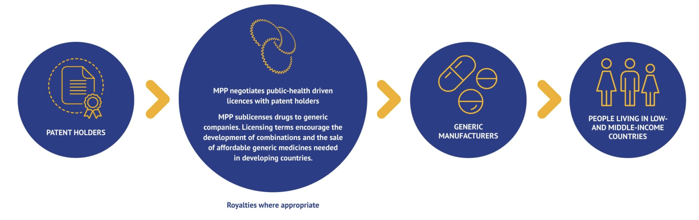
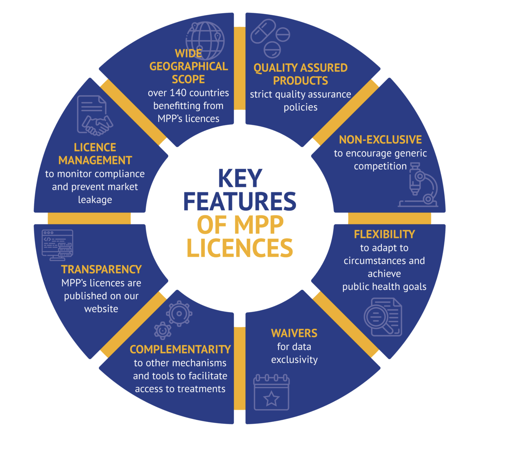

```{r setup, include=FALSE}
knitr::opts_chunk$set(echo = TRUE)
```

## COVID-19 Vaccine Access in Low-Middle Income Countries (LMICs) {.unnumbered}

In Module 2 we examined the crises in antibiotic development including its impact on low-middle income countries (LMICs). We also highlighted special challenges related to antibiotic access in countries where healthcare resources are limited. In this module we will further explore the challenges of improving corona varus vaccine and diagnostic testing access, and what lessons can be taken and applied to antimicrobial resistance.

However, at the time of the lesson we are in the midst a fourth wave of COVID-19 infections. Therefore, it is worth considering where we stand at the moment worldwide with vaccinations.

As of December 30, 2021, the [WHO Coronavirus (COVID-19) Dashboard](https://covid19.who.int/) reports over 285 million cumulative cases and 5.4 million deaths. Over 1.3 million new cases are reported daily. Beyond direct illness and death, however, COVID-19 has spawned countless repercussions from mental health to a global supply chain breakdown. Some issues were predictable and some impossible to foresee in the area of global health, for example:

**TB deaths climbed worldwide** for the first time in a decade, according to [a October 14 WHO report](https://www.who.int/news/item/14-10-2021-tuberculosis-deaths-rise-for-the-first-time-in-more-than-a-decade-due-to-the-covid-19-pandemic) that directly tied the increase to the pandemic.

**Measles outbreaks** [may be more likely](https://www.cdc.gov/mmwr/volumes/70/wr/mm7045a1.htm?s_cid=mm7045a1_w) in the near future, after the number of infants missing their first vaccination jumped by 3 million last year---the largest increase in 20 years.

**Malaria's 241 million cases** and 627,000 deaths in 2020 reflect increases of 14 million and 69,000 respectively---both were largely attributed to pandemic disruptions, according to [WHO's global malaria report](https://www.who.int/teams/global-malaria-programme/reports/world-malaria-report-2021#:~:text=According%20to%20WHO's%20latest%20World,and%2069%20000%20more%20deaths) released on December 6.

According to the WHO, over 11 billion people must be vaccinated against COVID-19. As of December, 57.4% of the world population has received at least one dose of a COVID-19 vaccine. Over 8.99 billion doses have been administered globally, and 33.05 million are now administered each day. Ten countries account for 77% of the globally administered doses. However, the vaccine market has been cornered by rich nations. The EU, the UK, and the USA have all purchased far more vaccine than they can possibly use. Only 8.3% of people in LMICs have received at least one dose of COVID-19.

<figure>

<center>

<iframe src="https://ourworldindata.org/grapher/covid-vaccination-doses-per-capita?tab=map&amp;time=latest" loading="lazy" style="width: 100%; height: 600px; border: 0px none;">

</iframe>

<figcaption>

**Figure 1. COVID-19 vaccination doses administered per 100 people within a given population**. Data source: Our World in Data

</figcaption>

</figure>

<br> The data show that the African continent has been largely left behind in terms of COVID-19 vaccination. This lack of vaccine coverage may be a factor that is contributing to the emergence of new variants such as Omicron, which seem to have emerged from the African continent. However, access to testing and sequencing of strains is also limited, so the current epidemiological picture of COVID is not entirely clear.

<figure>

{width="800"}

<figcaption>

**Figure 2. Percent of COVID-19 representing the Omicron Variant as of December 26, 2021**. Data source: The Economist

</figcaption>

</figure>

### COVID-19 Vaccines Global Access (COVAX) Program {.unnumbered}

The COVAX program was a group purchasing program that combines high-income and low-middle-income countries. The program is based on the idea that the world would unite and buy vaccines together, with high- and middle-income countries paying for themselves, and low-middle-income countries receiving subsidized doses. Once the vaccines were licensed and pre-qualified by the WHO, COVAX funds then pay for the purchase of doses for all 92 eligible countries. The guarantees are designed to incentivise manufacturers to ensure that enough doses are produced for LMIC economies, which collectively represent almost half the world's population.

-   HIC countries make higher contributions up-front in order to establish the funding to get manufacturing capacity in place. While it is not expected that they will entirely rely on the the program to receive vaccine, it represents and insurance (back-up) if other negotiated channels of vaccine distribution fall-through

-   Doses for lower-income economies will also be procured through the COVAX Facility but will be paid for via the separate financial mechanism of the COVAX, which will be largely funded through Official Development Assistance (ODA), as well as contributions from the private sector and philanthropy. Even so, it is likely that the 92 ODA-eligible countries accessing vaccines through the COVAX AMC may also be required to share some of the costs of COVID-19 vaccines and delivery. Through this cost-sharing approach, countries will have an opportunity to complement and build on the essential foundation built by these early, donor funded doses if they wish to achieve a higher population coverage.

-   To help each economy, the Global Alliance for Vaccines and Immunisation (Gavi) provided up to US\$ 150 million in initial funding to jumpstart support for COVAX -eligible country readiness in preparation for COVID-19 vaccines delivery, in the form of planning, technical assistance and cold chain equipment. In addition to this, the Alliance has developed a number of tools to help countries prepare, including the Country Readiness Assessment tool. This will enable each country to develop a national vaccination deployment plan, to assess their capacity for vaccine storage and distribution, and, in the context of the infodemic of misinformation about vaccine safety we are experiencing, help them prepare a comprehensive communication plan, to ensure people understand why COVID-19 vaccination is so important and who will get priority.

### How is COVAX working? {.unnumbered}

-   Phase 1 allocation by COVAX consists of the proportional allocation of 20% of the population until all countries are covered to this level. This was intended to end the acute phase of the pandemic by securing enough doses to ensure health workers, elderly people, and vulnerable groups were protected by the end of 2021.

-   Phase 2 of vaccine allocation by COVAX will take a more epidemiological approach, consisting of weighted allocation dependent on the proportional coverage requested by countries and consideration of vulnerability and COVID-19 threat. Flexibility tailored to epidemiology in allocation of vaccines, therapeutics, and diagnostics is critical but requires sophisticated country level data collection and flows

-   Although COVAX promised 100 million doses by the end of March, this goal was not reached until 6 July. By mid-August of 2021, COVAX delivered 200 million vaccine doses to nearly 140 countries instead of the 600 million doses initially projected. **Currently, less than 6% of population of sub-Saharan Africa are vaccinated against COVID-19.** In regions like sub-Saharan Africa, health officials are still struggling to get their hands on vaccines to protect workers on the front lines of the pandemic.

```{=html}
<style>
div.blue { background-color:#e6f0ff; border-radius: 5px; padding: 20px;}
</style>
```
::: blue
Explore the data on vaccine distribution using the [UN Global Dashboard for Vaccine Equity](https://data.undp.org/vaccine-equity/)
:::

-   A major source of the vaccines for the COVAX program was the AstraZeneca/Oxford vaccine that through licensing agreements was being manufactured in part by the Serum Institute in India. However, when a third COVIF-19 wave hit India, over 400 million doses of the Oxford--AstraZeneca vaccine doses was diverted for domestic use in India. COVAX has had to contend with a number of severe challenges, including supply bottlenecks and continued vaccine nationalism that have prevented it from being able to access doses as quickly as possible.

High-income countries also did not ultimately did not surrender their negotiating power to international organizations such as COVAS/WHO. Canada, UK, Australia, New Zealand, EU, and US secured \>200% population coverage worth of vaccine doses, leaving insufficient for LMICs and COVAX. Wealthy countries soon rocketed ahead, COVAX's pledge to distribute vaccines in poor countries at the same time they rolled out in rich countries in terms of vaccinations while LMICs were left behind. **As a result, Covax expects around 1.9 billion doses to be available to 92 LMICs before the end of 2021, covering roughly 27% of their population, well short of the coverage required to control the pandemic.**

A fundamental challenge that has to be overcome is that HICs produce vaccines, invest in research development, and secure the supplies. This shuts the rest of the world out of the market.

The COVAX effort, however laudable in intent, has been undercut by vaccine scarcity and underfunding and additional strategies are needed. COVAX was unable to compete with high income nations with greater purchasing power or hosting big manufacturers. Many LMICs do not have an established platform for vaccinating their adult populations. Although it is feasible to deliver COVID-19 vaccines to health-care and other front-line essential workers, in some LMICs it will be difficult to effectively reach and vaccinate with two doses all elderly populations and individuals with co-morbidities, given insufficient mechanisms to identify such groups.

The ultracold chain requirements of mRNA COVID-19 vaccines are likely to be an insurmountable hurdle in LMICs, outside of major cities. COVID-19 vaccine delivery will require considerable investment of resources, health-care staff, and careful planning to avoid opportunity costs, including a disruption of routine health services and a decline in essential childhood vaccination coverage, which could result in outbreaks of measles and other vaccine-preventable diseases. There were more deaths from measles than Ebola virus disease in 2019 in the aftermath of the Ebola outbreak in the Democratic Republic of the Congo, due to failure to maintain adequate childhood vaccinations

<br>

```{=html}
<style>
div.blue { background-color:#e6f0ff; border-radius: 5px; padding: 20px;}
</style>
```
::: blue
**What is GAVI?** By the late 1990s, the progress of international immunisation programmes was stalling. Nearly 30 million children in developing countries were not fully immunised against deadly diseases, and many others went without any immunisation at all. At the heart of the challenge was an acute market failure; powerful new vaccines were becoming available, but lower-income countries simply could not afford most vaccines. In response, the Bill & Melinda Gates Foundation and a group of founding partners brought to life an elegant solution to encourage manufacturers to lower vaccine prices for the poorest countries in return for long-term, high-volume and predictable demand from those countries. In 2000, that breakthrough idea became the Global Alliance for Vaccines and Immunisation -- today Gavi, the Vaccine Alliance.

GAVI now vaccinates almost half of the world's children, giving it tremendous power to negotiate vaccines at prices that are affordable for the poorest countries and to remove the commercial risks that previously kept manufacturers from serving them.Because of these market shaping efforts, the cost of fully immunising a child with all 11 WHO-recommended childhood vaccines now costs about US\$ 28 in Gavi-supported countries, compared with approximately US\$ 1,200 in the United States of America. At the same time, the pool of manufacturers producing prequalified Gavi-supported vaccines has grown from to 18 in 2020 (with more than half based in Africa, Asia and Latin America).

Gavi shares the cost that implementing countries pay for vaccines, which has resulted in more than 495 vaccine introductions and campaigns, dramatically boosting immunisation against virulent diseases. For example, 3% of low-income countries had introduced nationally *Haemophilus influenzae* type b (Hib) vaccine that protects against diseases like pneumonia and meningitis. Today, Gavi has enabled all low-income countries to introduce this vaccine in their national programmes. Progress on the third dose of Hib vaccine coverage, as well as with pneumococcal conjugate vaccine (PCV), has been so successful that the coverage rate in Gavi-supported countries is now higher than the global average coverage rate. By the end of 2019, 16 countries had transitioned out of Gavi support and are fully financing all vaccine programmes introduced with Gavi support.
:::

<figure>

<center>

<br>

<br>

{width="600"}

<figcaption>

**Image:** Lancet Infectious Diseases

</center>

</figcaption>

</figure>

<br> **What can be done to address COVID-19 vaccine inequity?**

COVID-19 vaccine inequity will have a lasting and profound impact on socio-economic recovery in LMICs without urgent action to boost supply, share vaccines and ensure they're accessible to everyone now. To provide vaccination to 70% of the population, HICs must boost their healthcare spending by an average of 0.8%, whereas LMICs must boost healthcare spending by 56.6%.

Three strategies could potentially improve the dire situation of COVID-19 vaccine inequity in LMICs\

1.  **Bilateral donation of COVID-19 vaccine vaccine**. HICs such as the United States have pledged to donate The US has pledged to donate 1.1 billion doses to other countries. But deliveries so far have generally fallen drastically short of pledges.

2.  **Multilateral donation of COVID-19 vaccine.** Multiple countries have pledged top donate COVID-19 vaccine to Gavi and the WHO.

3.  **Creation of manufacturing capacity in LMICs**. Africa consumes 25% of the world's vaccines, but do not manufacture any of them. Access to vaccines could be improved if some of the manufacturing could be moved to the African continent. This would require a temporary intellectual property (IP)waiver for COVID-19 vaccines,[@ErfaniEtAl2021a]The waiver would prevent companies that hold the IP for COVID-19 vaccines from blocking vaccine production elsewhere on the grounds of IP and allow countries to produce COVID-19 medical goods locally and import or export them expeditiously. This IP waiver has been supported by the World Trade Organization and several nations, but faces stiff political and pharmaceutical-industry industrial opposition. No agency is mandated to finance and strengthen manufacturing capacity for vaccines, therapeutics, and diagnostics. Expanding regional capacity for key platform technologies (eg. monoclonal antibodies and mRNA) to avoid reliance on few manufacturers and fortify supply systems should be a priority. It requires transfer of highly specific and specialised technology and know-how, in coordination with regulatory oversight, robust participation of vaccine developers, and application of good, consistent, laboratory biological manufacturing practices, and addressing financial sustainability of such facilities. Given the large challenges, a strong system is required to accelerate progress. Platforms and tools to enable technology transfer, such as the COVID-19 technology access pool [(C-TAP)](https://www.who.int/initiatives/covid-19-technology-access-pool) and the [WHO vaccine technology transfer hub](https://www.who.int/news-room/articles-detail/establishment-of-a-covid-19-mrna-vaccine-technology-transfer-hub-to-scale-up-global-manufacturing) have not been effectively used. The intellectual property right TRIPS waiver proposed by South Africa and India was not supported by several high income countries.

4.  **Improvements in allocation and delivery of vaccines** Countries often receive notice on vaccine allocation without knowing when doses will arrive. This makes the planning of vaccination extremely difficult and slows down the preparation for vaccinations, including the use of funds from the World Bank and other institutions. MThis is increasing the risk of countries not being prepared when large quantities of doses arrive in late 2021 and across 2022, as planned by COVAX and other sources. Moreover, the infrastructure for vaccination in many LMICs is already inadequate, as shown by the 19.7 million under-vaccinated infants globally, most of whom are in these countries. Thus, preparation for all aspects of COVID-19 vaccine delivery in LMICs is essential. LMICs, particularly in Africa, are experiencing substantial difficulties with distribution, administration, and uptake (including from vaccine hesitancy). This highlights the importance of preparedness and systems building outside emergencies. High level political dialogues on vaccine supply and deployment have not taken place at global level despite their critical importance

### Access to SARS-CoV-2 testing in LMICs {.unnumbered}

Relatively less attention has been directed on improving diagnostic SARS-CoV-2 testing in LMICs. Many countries lack of a country-based testing plan and limited access to molecular (PCR) and even simple antigen (lateral flow) tests are limited. This creates challenges for understanding the epidemiology and current status of the disease in many coutnries. Other countries have adopted diagnostic algorithms that test only selected patients based on pre-existing diseases or meet a standard case-definition based on a clinical history or symptoms.[@BarrosEtAl2021] Importantly, In some LMICs endemic febrile illnesses are particularly common, and their presentation could easily be similar to that of COVID-19.

### Infection control in LMICs {.unnumbered}

The WHO recommends infection control interventions to reduce the risk of transmission, in particular,avoiding close contact with people suffering from acute respiratory infections, frequent hand washing especially after direct contact with infected people or their environment. Worldwide, governments have established regulations that require social distancing, the closure of non-essential businesses, travel restrictions and, in many cases, quarantine. Although these measures are necessary for public health, social restrictions are difficult to realize in LMICs due to money-related livelihood problems. A complete commercial shutdown like those imposed in China, Europe, or the United States may not be feasible from some residents of LMICs when a day without work is tantamount to a day without food.

The procurement of personal protective equipment (PPE) including masks and protective faceshields/gowns is also a challenge. In emergency situations, raincoats and windjackets are often used as gowns, while swimming caps, goggles, and transparent paper were used as PPE.

### Intensive care units (ICUs) in LMICs {.unnumbered}

The number of hospital beds and health workers is generally lower compared to that in HICs. The [WHO reports](https://www.who.int/data/gho/data/indicators/indicator-details/GHO/hospital-beds-(per-10-000-population)?bookmarkId=57250f95-5dcc-4a57-84d7-1b2faddeff80) only 0.8 hospital beds per 1000 people in LICs and 2.3 in LMICs. According to the WHO, 90% of LICs have fewer than 10 medical doctors per 10,000 people, compared to only 5% of HICs. Up to 93% of LICs have fewer than 40 nursing personnel per 10,000 people, compared to only 19% of HICs

The number of ICU beds is insufficient with respect to the population of LMICs.[@PasqualeEtAl2021]The most recent data available from the WHO indicate that Africa has fewer than 5000 ICU beds, corresponding to five beds per one million people. In Europe, by comparison, there are 4000 beds per one million people.

ICUs in LMICs are more likely to quipment is often old and poorly serviced. Mechanical ventilators tend to be old, and many hospitals do not have oxygen or medical gas to drive them. Generally, equipment maintenance is poorly performed if available, and funding for capital development is limited. When funding is available, the procurement system is plagued by corruption, leading to a fraudulent assignment. Furthermore, long distances and high transportation costs commonly result in delayed presentation of critically ill patients.

Laboratories are often located in the capital cities, so that early diagnosis and isolation becomes difficult. Furthermore, the infrastructures for the screening and treatment of COVID-19 are not separate from the ones devoted to non-COVID-19 healthcare, facilitating the spread of the infection.[@PasqualeEtAl2021]

## ACCESS TO COVID-19 Tools Accelerator (ACT) {.unnumbered}

Access to COVID-19 therapeutics have not yet received the same financial and political commitments as vaccines. Waning immunity and potential emergence of vaccine resistance among new variants may also compromise impact of vaccines. As has been the case with other vaccine-preventable illnesses such as bacterial meningitis, pertussis, and influenza, therapeutics can play an important role in disease control alongside vaccines. The Access to COVID -19 Tools Accelerator (ACT-A) is a multilateral coordination mechanism set up to accelerate development, production, and equitable access to COVID-19 tests, treatments, and vaccines globally. The concept brings together governments,scientists, businesses, civil society, philanthropists and global health organisations.

Despite its bold vision, ACT-A has thus far fallen short of its expectations. As described above, COVAX, the vaccines pillar of ACT-A, failed to meet the relative modest goals of 20% vaccination. Oxygen therapy, still one of the best treatments available for severe cases, has not been strategically prioritised despite its critical importance. Testing did receive political attention but has been a bottleneck in many countries. Dexamethasone

The Access to [COVID-19 Tools (ACT) Accelerator](https://www.who.int/initiatives/act-accelerator) brings together governments, scientists, businesses, civil society, and philanthropists and global health organizations (the [Bill & Melinda Gates Foundation](https://www.gatesfoundation.org/), [CEPI](https://cepi.net/), [FIND](https://www.finddx.org/), [Gavi](https://www.gavi.org/), [The Global Fund](https://www.theglobalfund.org/en/),[Unitaid](https://unitaid.org/), [Wellcome](https://wellcome.ac.uk/), the [WHO](https://www.who.int/home), and the [World Bank](https://www.worldbank.org/)).These organizations have joined forces to speed up an end to the pandemic by supporting the development and equitable distribution of the tests, treatments and vaccines the world needs to reduce mortality and severe disease, restoring full societal and economic activity globally in the near term, and facilitating high-level control of COVID-19 disease in the medium term.

Identifying inexpensive, widely available, and effective therapies against COVID-19 is, therefore, of great importance. Current effective and inexpensive therapies include corticosteroids (dexamethasone) the potentially useful serotonin re-uptake inhibitor (SSRI) fluvoxamine. However, access to potenti anti-inflammtory agents such as toclizumbab, or the antivirals remdesivir, manuprivir, R.

**Global efforts to date have been unsuccessful in providing equitable access to covid-19 vaccines, therapeutics, and diagnostics**. A core underlying issue has been a lack of shared vision that these essential public health tools should be considered a "global health commons". Future systems for vaccines, therapeutics, and diagnostics should be pre-negotiated among countries, manufacturers, and international institutions. Future systems should be reshaped to ensure equitable access is considered from design through to manufacturing and procurement processes. Agreements around technology transfer and intellectual property licensing, regional trial networks, inclusive governance, and substantial predictable financing are essential

<figure>

<center>

{width="600"}

<figcaption>

**Image:** World Health Organization

</center>

</figcaption>

</figure>

## Medicines Patent Pool {.unnumbered}

The [Medicines Patent Pool (MPP)](https://medicinespatentpool.org/) is a United Nations-backed public health organisation working to increase access to, and facilitate the development of, life-saving medicines for low- and middle-income countries. Through its innovative business model, MPP partners with civil society, governments, international organisations, industry, patient groups, and other stakeholders, to prioritise and license needed medicines and pool intellectual property to license the generic manufacture and the development of new formulations in developing countries.

**How does it work?** MPP operates as a non-profit voluntary licensing mechanism through partnerships with originator pharmaceutical companies who develop innovative medications (i.e. more effective and less toxic) but are still patent protected.

<figure>



<figcaption>

**Figure 3. How the Medicines Patient Pool licences medicines for public health.**

</center>

</figcaption>

</figure>

MPP negotiates licences with patent holders (originator) and sub-licenses rights to manufacture and distribute the drug in the country of interest to generic manufacturers, sometimes in exchange for royalties to the original innovator. In turn, the MPP ensures that the drugs are appropriately registered in the country, their is adequate competition for production of the medication (to keep prices low and prevent a monopoly), and promotes rapid uptake and utilization in the health through communication and agreements with governmental, medical and patient advocacy groups.

The advantages are three fold:

1.  Innovators have their drug manufactured and distributed in LMICs using a proven mechanism with oversight and receive royalty payments
2.  Generic companies have access to manufacture and distribute innovative medicines that are still on patient
3.  Patients get access to affordable and more effective medications that saves lives

{width="800"}

**Figure 4. How the Medicines Patient Pool licences medicines for public health.**

For an excellent explanation of the how the Medicine Patnet Pools works, see this explanation by Dr. Greg Martin: <https://www.youtube.com/watch?v=FnVJPQ1ZINw>

### MPP and COVID-19 {.unnumbered}

The MPP created a mRNA vaccine Technology Transfer Hub in July 2021. The purpose of the hub is to increase access to mRNA vaccines made closer to home by establishing manufacturing capacity in Africa using a technology transfer hub model to ensure sustainable vaccine security in future pandemics. The first COVID-19 mRNA vaccine technology transfer hub has been established in South Africa. The MPP has also erntered into license agreements agreements for Merck's molnupiravir and Pfizer ritonavir/nirmatrelvir oral COVID-29 therapies. The MPP has also licensed an ELISA antibody technology for serolgic testing

### MPP and HIV {.unnumbered}

Today, only a third of the people requiring treatment for HIV/AIDS have access to therapy. Drug resistance means that new drugs are required to treat the condition, but these are often unaffordable for the most affected communities. To date, MPP has signed agreements with ten patent holders for 13 HIV antiretrovirals and a technology for injectable long-acting HIV drug combination technology.

### MPP and Hepatitis C {.unnumbered}

Around 58 million people live globally with HCV, many of them in LMICs, with the vast majority remaining undiagnosed and untreated. New direct-acting antivirals (DAA) that are effective across all major HCV strains can cure millions. Yet, approximately 84% of the people infected with HCV are not receiving treatment Around 290,000 people die each year from hepatitis C, mostly from cirrhosis and liver cancer. Direct-acting antiviral medicines can cure more than 95% of patients. The Medicines Patent Pool works with generic partners to speed the development and distribution of these new treatments that can eliminate the virus through a short course of oral therapy in regions with a high HCV burden.

MPP signed licence agreements for three hepatitis C treatments: daclatasvir (DAC) in 2015, ravidasvir (RAV) in 2017 and glecaprevir/pibrentasvir (G/P) in 2018.

MPP has also secured licenses for tenofovir disoproxil fumarate (TDF) and tenofovir alafenamide (TAF), benefit people living with HIV as well as people living with chronic hepatitis B, a disease affecting 296 million globally. The majority of people with hepatitis B live in low- and middle-income countries.

### Tuberculosis {.unnumbered}

Tuberculosis (TB) is a global pandemic affecting around 10 million people worldwide. In 2018, the disease caused 1.5 million deaths, and it is the leading killer of people living with HIV. Almost 90% of TB deaths occur in low- and middle-income countries. The World Health Organization's post-2015 Global TB Strategy sets ambitious targets aimed at reducing TB deaths by 95% between 2015 and 2035, and to end TB. To meet these targets, faster acting, better therapies to treat TB are urgent, particularly for multidrug-resistant TB (MDR-TB). The MPP's fovus is to secure access to new treatments for MDR-TB and drug-susceptible tuberculosis. Th MPP also facilitates the development of new regimens by licensing TB drugs that are still under development. In early 2017, MPP signed its first agreement with the Johns Hopkins University. This agreement was to facilitate the clinical development of sutezolid, a promising investigational treatment for tuberculosis. It was followed by a second agreement with Pfizer in October 2019 to access Pfizer's preclinical, phase I and phase IIa clinical study data and results on sutezolid.

### Is the Medicines Patient Pool Working? {.unnumbered}

The Medicines Patent Pool (MPP) has signed agreements with 13 patent holders for thirteen HIV antiretrovirals, one HIV technology platform, three hepatitis C direct-acting antivirals, a tuberculosis treatment, two long-acting technologies, two experimental oral antiviral treatments for COVID-19 and a COVID-19 serological antibody diagnostic test. 25 generic manufacturers and product developers have now signed MPP sublicensing agreements.

Generic competition is making a difference in fostering lower prices and improving treatment coverage. Generic partners have distributed **49.71 million** patient-years of HIV and hepatitis C products, saving international procurers **USD 920 million** (January 2012-December 2020).

<figure>


<figcaption>

**Figure 5. Impact of the Medicines Patent Pool.** Source: medicinespatientpool.org

</center>

</figcaption>

</figure>

## Counterfit Medications {.unnumbered}

What is a fake medicine?

Interpol defines a counterfeit or substandard medicine as one that differs from the authentic version of the vaccine by:

-   Containing too much or too little of one or more ingredients, or containing different ingredients

-   Claiming to have different properties or side effects

-   Having a different shape, size, taste, or colour

-   Being not correctly labelled or not labelled at all

-   Having an out-of-date or missing expiry date

-   Not including information on how to store the medicine

-   Having packaging that looks poorly constructed, is labelled with spelling or grammar errors, or appears to have been interfered with

WHO estimates that up to 1% of medicines available in high income countries are likely to be counterfeit, but this figure rises to 10% globally. In LMICs, **1 in 10 medicines are thought to be either substandard or falsified**. Nearly 170,000 children die annually of falsified pneumonia medicines and substandard and falsified antimalarials may cause as many as 116,000 deaths from malaria annually in sub-Saharan Africa. The limited data available on this issue means the known figures almost certainly represent just a fraction of the true burden of falsified medicines around the globe.

In the past year, the black market in fake medicines grew by more than 400%, according to a report by the Medicine Quality Research Group, Centre of Tropical Medicine & Global Health, Nuffield Department of Medicine and the University of Oxford. [@MedicineQualityResearchGroup2021]**There is a growing online trend of fake websites that mimic real pharmaceutical websites where COVID-19 vaccines are sold up to \$1000 and vaccine certificates for \$200.** Moreover, the "trickle down" of vaccine donations from richer countries has left populations---and particularly health workers---in LMICs vulnerable to infection, with some turning to unlicensed vendors for vaccines.

WHO has warned that the vaccine equity gap continues to be exploited by organised criminal groups for profit as they pivot from personal protective equipment and diagnostics towards vaccines. Given that fake vaccine cards and passports are becoming a profitable business, authorities have urge citizens not to share photos of them on social media. Therefore, it is of utmost importance to share vaccine rollout in an equitable way around the globe so poorer countries are protected against the proliferation of falsified medicines.

The globalisation of the pharmaceutical industry has spread both fake and substandard products worldwide.[@Srivastava2021] Active ingredients may come from China, while the product may be manufactured in India and be packaged in a third country before being shipped through Dubai. It might then be repackaged and shipped to yet another country to take advantage of exchange rates. These many steps provide places for fraud to occur.

<figure>


<figcaption>

**Figure 6. Sources of counterfeit drugs.** Source Financial Times

</center>

</figcaption>

</figure>

A common practice is to procure empty vials and refill them with saline solution or substandard products. "Knock-offs" that contain lower concentrations of the active pharmaceutical ingredients than the official drug are also common. "Small pharma companies, especially those which do outsource work for big companies, often flout good manufacturing practices to cut the cost," he adds.

### What are the solutions for counterfeit drugs? {.unnumbered}

## COVID-19 and lessons for the AMR crises {.unnumbered}

## References {.unnumbered}
