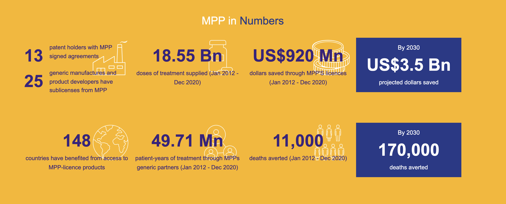

# Module 3: Antibiotic and diagnostic test availability, affordability in LMICs {.unnumbered}

<center>

{width="800"}

<figcaption>

Image: World Health Organization

</figcaption>

</center>

## COVID-19 Vaccine Access in Low-Middle Income Countries (LMICs) {.unnumbered}

In Module 2 we examined the crises in antibiotic development including its impact on low-middle income countries (LMICs). We also highlighted special challenges related to antibiotic access in countries where healthcare resources are limited. In this module we will further explore the challenges of improving antibiotic or vaccine availability and access to diagnostic testing through recent experiences with the COVID-19 pandemic.

As of December 30, 2021, the [WHO Coronavirus (COVID-19) Dashboard](https://covid19.who.int/) reports over 285 million cumulative cases and 5.4 million deaths due to SARS-CoV-2. Over 1.3 million new cases are reported daily.

<figure>

<center>

<iframe src="https://covid19.who.int/" loading="lazy" style="width: 100%; height: 800px; border: 0px none;">

</iframe>

<figcaption>

**Figure 1. WHO COVID-19 Dashboard:** <https://covid19.who.int/>

</figcaption>

</figure>

For Africa-specific data, see: <https://africacdc.org/covid-19/>

Beyond direct illness and death, COVID-19 has spawned countless repercussions from mental health to breakdowns in the global supply chain for many healthcare and consumer goods. Although some issues were predictable, others were impossible to foresee in the area of global health, for example:

-   TB deaths also climbed worldwide for the first time in a decade, according to [a October 14 WHO report](https://www.who.int/news/item/14-10-2021-tuberculosis-deaths-rise-for-the-first-time-in-more-than-a-decade-due-to-the-covid-19-pandemic) that directly tied the increase to the pandemic.
-   Measles outbreaks [may be more likely](https://www.cdc.gov/mmwr/volumes/70/wr/mm7045a1.htm?s_cid=mm7045a1_w) in the near future, after the number of infants missing their first vaccination jumped by 3 million last year---the largest increase in 20 years.
-   Malaria's 241 million cases and 627,000 deaths in 2020 reflect increases of 14 million and 69,000 respectively---both were largely attributed to pandemic disruptions, according to [WHO's global malaria report](https://www.who.int/teams/global-malaria-programme/reports/world-malaria-report-2021#:~:text=According%20to%20WHO's%20latest%20World,and%2069%20000%20more%20deaths) released on December 6.

According to the WHO, over 11 billion people must be vaccinated against COVID-19. As of December, 57.4% of the world population has received at least one dose of a COVID-19 vaccine. Over 8.99 billion doses have been administered globally, and 33.05 million are now administered each day. **Ten countries account for 77% of the globally administered doses.** Unfortunately, the vaccine market has been cornered by rich nations. The EU, the UK, and the USA have all purchased far more vaccine than they can possibly use. **Only 8.3% of people in LMICs have received at least one dose of COVID-19.**

<figure>

<center>

<iframe src="https://ourworldindata.org/grapher/covid-vaccination-doses-per-capita?tab=map&amp;time=latest" loading="lazy" style="width: 100%; height: 600px; border: 0px none;">

</iframe>

<figcaption>

**Figure 2. COVID-19 vaccination doses administered per 100 people within a given population**. Data source: Our World in Data

</figcaption>

</figure>

<br> The data illustrated in the map below shows that the African continent has been largely left behind in terms of COVID-19 vaccination. This lack of vaccine coverage is undoubtedly contributing to the emergence of new variants such as Omicron on the African continent. However, access to testing and sequencing of strains is also limited in in many regions of Africa, so the current epidemiological picture of COVID is not entirely clear.

<figure>

{width="800"}

<figcaption>

**Figure 2. Percent of COVID-19 representing the Omicron Variant as of December 26, 2021**. Data source: The Economist

</figcaption>

</figure>

### COVID-19 Vaccines Global Access (COVAX) Program {.unnumbered}

The COVAX program is a program for purchasing and distributing COVID-19 vaccine developed at the start of the COVID-19 pandemic that combines high-income (HIC) and low-middle-income countries (LMICs). The program is based on the idea that the world would unite and buy vaccines together, with HIC paying for themselves, and LMICs receiving subsidized pricing. Once the vaccines were licensed and pre-qualified by the WHO, COVAX funds pay for the purchase of doses for all 92 eligible countries. The program thus provides guarantees to manufacturers to help ensure that enough doses are produced for LMIC economies, which collectively represent almost half the world's population.

-   HIC countries make higher contributions up-front in order to establish the funding and provide financial resources needed to establish manufacturing capacity. While it is not expected that HICs will entirely rely on the the program to receive vaccine, it was expected that their vaccine purchases through the COVAX program would represent a type of "insurance" or back-up plan if other negotiated channels of vaccine distribution fell-through from other manufacturers.

-   Vaccine doses for LMICs will also be procured through the COVAX but will be paid for via the separate financial mechanism funded largely through Official Development Assistance (ODA), as well as contributions from the private sector and philanthropy. Even so, it is likely that the 92 ODA-eligible countries accessing vaccines through the COVAX AMC would also be required to share some of the costs of COVID-19 vaccines and delivery. Through this cost-sharing approach, countries are expected to build on the essential foundation built by these early, donor funded doses, if they wish to achieve a higher population coverage.

-   To help each economy, the Global Alliance for Vaccines and Immunisation (Gavi) provides up to an additional US\$ 150 million in initial funding to jumpstart planning, technical assistance and cold chain equipment resources needed to deliver the vaccines. The Alliance also prepares a Country Readiness Assessment tool to aid development of a national vaccination deployment plan and public communications strategy.

### Is the COVAX program suceeding? {.unnumbered}

-   Phase 1 allocation by COVAX planned to allocate enough vaccine doses to cover 20% of the population until all participating countries reached this coverage level. The expectation that the initial 20% would include essential healthcare workers, elderly people, and vulnerable groups for protection by the 2021.

-   Phase 2 of vaccine allocation by COVAX will take a more epidemiological approach, consisting of weighted allocation depending on the proportional coverage requested by countries and consideration of vulnerability and ongoing severity of the COVID-19 threat. It was recognized that this would require sophisticated country level data collection and surveillance programs that would take time to establish.

Ultimately, these goals required that COVAX deliver 100 million doses of COVID-19 vaccine by the end of March. This goal was not reached until 6 July. By mid-August of 2021, COVAX delivered 200 million vaccine doses to nearly 140 countries instead of the 600 million doses initially projected. **Currently, less than 6% of population of sub-Saharan Africa are vaccinated against COVID-19.** In these regions, health officials are still struggling to get their hands on vaccines to protect workers on the front lines of the pandemic and counterfeit vaccines are being sold.

```{=html}
<style>
div.blue { background-color:#e6f0ff; border-radius: 5px; padding: 20px;}
</style>
```
::: blue
Explore the data on vaccine distribution using the [UN Global Dashboard for Vaccine Equity](https://data.undp.org/vaccine-equity/)
:::

<br>

-   One of the key sources of the vaccines for the COVAX program was the AstraZeneca/Oxford vaccine that through licensing agreements was being manufactured in part by the Serum Institute in India. However, when a third COVID-19 wave hit India, over 400 million doses of the Oxford--AstraZeneca vaccine were diverted for domestic use in India. This created severe supply bottlenecks and continued vaccine nationalism that have prevented it from being able to access doses as quickly as possible.
-   High-income countries ultimately did not surrender their negotiating power to international organizations such as COVAX. The US, EU, Canada, UK, Australia, and New Zealand secured >200% population coverage worth of vaccine doses, leaving insufficient doses for LMICs and COVAX. Wealthy countries soon rocketed ahead in terms of vaccination and LMICs were left behind. **As a result, COVAX has revised predictions that 1.9 billion doses will eventually be available to 92 LMICs before the end of 2021, covering roughly 27% of their population, well short of the coverage required to control the pandemic.**

These challenges illustrated a fundamental problem: HICs produce vaccines, invest in research development, and secure the supplies. This shuts the rest of the world out of the market.

The COVAX effort, however laudable in intent, has thus far been undercut by lack of funding and vaccine scarcity. COVAX was unable to compete with high income nations with greater purchasing power or hosting big manufacturers. Many LMICs do not have an established platform for vaccinating their adult populations. Although it is feasible to deliver COVID-19 vaccines to health-care and other front-line essential workers, in some LMICs it will be difficult to effectively reach and vaccinate with two doses all elderly populations and individuals with co-morbidities, given insufficient mechanisms to identify such groups.

The ultracold supply chain requirements of mRNA COVID-19 vaccines may be an insurmountable hurdle in LMICs outside of major cities. COVID-19 vaccine delivery will require considerable investment of resources, health-care staff, and careful planning to avoid opportunity costs, including a disruption of routine health services and a decline in essential childhood vaccination coverage, which could result in outbreaks of measles and other vaccine-preventable diseases.

```{=html}
<style>
div.blue { background-color:#e6f0ff; border-radius: 5px; padding: 20px;}
</style>
```
::: blue
**What is Gavi?** "By the late 1990s, the progress of international immunisation programmes was stalling. Nearly 30 million children in developing countries were not fully immunised against deadly diseases, and many others went without any immunisation at all. At the heart of the challenge was an acute market failure; powerful new vaccines were becoming available, but lower-income countries simply could not afford most vaccines. In response, the Bill & Melinda Gates Foundation and a group of founding partners developed a solution to encourage manufacturers to lower vaccine prices for the poorest countries in return for long-term, high-volume and predictable demand from those countries. In 2000, that breakthrough idea became the Global Alliance for Vaccines and Immunisation -- today Gavi, the Vaccine Alliance.

Gavi now vaccinates almost half of the world's children, giving it considerable power to negotiate vaccines at prices that are affordable for the poorest countries and to remove the commercial risks that previously discouraged manufacturers from distributing vaccines in these markets. Because of these efforts, the cost of fully immunising a child with all 11 WHO-recommended childhood vaccines now costs about US\$ 28 in Gavi-supported countries, compared with approximately US\$ 1,200 in the United States of America. At the same time, the pool of manufacturers producing pre-qualified Gavi-supported vaccines has grown to 18 in 2020 (with more than half based in Africa, Asia and Latin America).

Gavi shares the cost that implementing countries pay for vaccines, which has resulted in more than 495 vaccine introductions and campaigns, dramatically boosting immunisation against virulent diseases. For example, 3% of low-income countries had introduced nationally *Haemophilus influenzae* type b (Hib) vaccine that protects against diseases like pneumonia and meningitis. Today, Gavi has enabled all low-income countries to introduce this vaccine in their national programmes. Progress on the third dose of Hib vaccine coverage, as well as with pneumococcal conjugate vaccine (PCV), has been so successful that the coverage rate in Gavi-supported countries is now higher than the global average coverage rate. By the end of 2019, 16 countries had transitioned out of Gavi support and are fully financing all vaccine programmes introduced with Gavi support."

Description is taken from the [Gavi Alliance Website](https://www.gavi.org/our-alliance/about)
:::

<br>

<figure>

<center>

<br>

<br>

{width="600"}

<figcaption>

**Image:** Lancet Infectious Diseases

</center>

</figcaption>

</figure>

<br> **What can be done to address COVID-19 vaccine inequity?**

COVID-19 vaccine inequity will have a lasting and profound impact on socio-economic recovery in LMICs. To provide vaccination to 70% of the population, HICs must boost their healthcare spending by an average of 0.8%, whereas LMICs must boost healthcare spending by 56.6%.

Three strategies could potentially improve the dire situation of COVID-19 vaccine inequity in LMICs\

1.  **Bilateral donation of COVID-19 vaccine vaccine**. HICs such as the United States have pledged to donate 1.1 billion doses to other countries. But deliveries so far have generally fallen drastically short of pledges.

2.  **Multilateral donation of COVID-19 vaccine.** Multiple countries have pledged to donate COVID-19 vaccine to Gavi and the WHO, although similar to the U.S. the actual deliveries are well behind schedule.

    <br>

    {width="800"}

    <figcaption>

    **Figure 3. Lagging COVID-19 donations by high-income countries**. Source: Vox media.

    </center>

    </figcaption>

    </figure>

    <br>

3.  **Creation of manufacturing capacity in LMICs**. Africa consumes 25% of the world's vaccines, but do not manufacture any of them. Access to vaccines could be improved if some of the manufacturing could be moved to the African continent. This would require a temporary intellectual property (IP) waiver for COVID-19 vaccines,[@ErfaniEtAl2021a]The waiver would prevent companies that hold the IP for COVID-19 vaccines from blocking vaccine production elsewhere on the grounds of IP and allow countries to produce COVID-19 medical goods locally and import or export them expeditiously. This IP waiver has been supported by the World Trade Organization and several nations, but faces stiff political and pharmaceutical-industry industrial opposition.

No agency is mandated to finance and strengthen manufacturing capacity for vaccines, therapeutics, and diagnostics. Expanding regional capacity for key platform technologies (e.g., monoclonal antibodies and mRNA) to avoid reliance on few manufacturers and fortify supply systems should be a priority and will be essential for preparation for future pandemics. It requires transfer of highly specific and specialised technology and know-how, in coordination with regulatory oversight, robust participation of vaccine developers, and application of good, consistent, laboratory biological manufacturing practices, and addressing financial sustainability of such facilities. Given the large challenges, a strong system is required to accelerate progress. Platforms and tools to enable technology transfer, such as the COVID-19 technology access pool [(C-TAP)](https://www.who.int/initiatives/covid-19-technology-access-pool) and the [WHO vaccine technology transfer hub](https://www.who.int/news-room/articles-detail/establishment-of-a-covid-19-mrna-vaccine-technology-transfer-hub-to-scale-up-global-manufacturing) have not been effectively used. The intellectual property right TRIPS waiver proposed by South Africa and India was not supported by several high income countries.

Recently, some progress has been made in this area with approval of mRNA vaccine capability in South Africa. A new COVID-19 vaccine was also recently approved/licensed for COVID-19 [designed specifically for global health](https://www.scientificamerican.com/article/a-covid-vaccine-for-all/)- i.e. the vaccine is produced using technology that has been employed worldwide for decades, meaning that manufacturing processes are generally already well-known and won't require a steep learning curve like the one needed for the scale-up of mRNA, adenovirus and protein particle vaccines.

This strategy has been a major focus of the largely successful [Medicines Patent Pool] described below

4.  **Improvements in allocation and delivery of vaccines** Countries often receive notice on vaccine allocation without actual knowledge of when doses will arrive. This makes the planning of vaccination difficult and slows down the preparation for vaccinations, including the use of funds from the World Bank and other institutions. It was essential that countries were well-prepared when the planned large quantities of doses arrives in late 2021 and across 2022, as infrastructure for vaccination in many LMICs is already inadequate, as already shown by the 19.7 million under-vaccinated infants globally, most of whom are in these countries. Many LMICs, particularly in Africa, are experiencing substantial difficulties with distribution, administration, and uptake (including from vaccine hesitancy). High level political leadership on vaccine supply and deployment have not taken place at global level despite their critical importance for exiting this health crises.

### Access to SARS-CoV-2 testing in LMICs {.unnumbered}

Relatively less attention has been directed on improving diagnostic SARS-CoV-2 testing in LMICs. Many countries lack of a country-based testing plan and have limited access to molecular (PCR) and even simple antigen (lateral flow) tests or serology. This creates challenges for tracking new cases and understanding the current epidemiology of infections in many regions. Other countries have adopted diagnostic algorithms that test only selected patients based on pre-existing diseases or meet a standard case-definition based on a common, and their presentation could easily be similar to that of COVID-19.

### Infection control in LMICs {.unnumbered}

The WHO recommends infection control interventions to reduce the risk of transmission, in particular, avoiding close contact with people suffering from acute respiratory infections, frequent handwashing especially after direct contact with infected people or their environment. Worldwide, governments have established regulations that require social distancing, the closure of non-essential businesses, travel restrictions and, in many cases, quarantine. Although these measures are necessary for public health, social restrictions are difficult to realize in LMICs due to money-related livelihood problems. A complete commercial shutdown like those imposed in China, Europe, or the United States may not be feasible from some residents of LMICs when a day without work is tantamount to a day without food.

The procurement of personal protective equipment (PPE) including masks and protective faceshields/gowns is also a challenge. In emergency situations, raincoats and windjackets are often used as gowns, while swimming caps, goggles, and transparent paper were used as PPE. Healthcare facilities do not have the necessary space and resources to screen and treatment of COVID-19 patients separate areas and patients devoted to non-COVID-19 healthcare, facilitating the spread of the infection.[@PasqualeEtAl2021]

### Intensive care units (ICUs) in LMICs {.unnumbered}

The number of hospital beds and health workers is generally lower compared to that in HICs. The [WHO reports](https://www.who.int/data/gho/data/indicators/indicator-details/GHO/hospital-beds-(per-10-000-population)?bookmarkId=57250f95-5dcc-4a57-84d7-1b2faddeff80) only 0.8 hospital beds per 1000 people in LICs and 2.3 in LMICs. According to the WHO, 90% of LICs have fewer than 10 medical doctors per 10,000 people, compared to only 5% of HICs. Up to 93% of LICs have fewer than 40 nursing personnel per 10,000 people, compared to only 19% of HICs

The number of ICU beds is insufficient with respect to the population of LMICs.[@PasqualeEtAl2021]The most recent data available from the WHO indicate that Africa has fewer than 5000 ICU beds, corresponding to five beds per one million people. In Europe, by comparison, there are 4000 beds per one million people (800-fold difference).

ICUs in LMICs are more likely to have equipment is often old and poorly serviced. Mechanical ventilators tend to be older, and many hospitals may not have oxygen or medical gas to drive them. Generally, equipment maintenance is poorly performed, and funding for capital development is limited. When funding is available, the procurement systems are often plagued by corruption, leading to a fraudulent assignment. Furthermore, long distances and high transportation costs commonly result in delayed presentation of critically ill patients.

Laboratories are often located in the capital cities, so that early diagnosis and isolation becomes difficult.

## ACCESS TO COVID-19 Tools Accelerator (ACT) {.unnumbered}

Access to COVID-19 therapeutics (i.e. oxygen, antiviral therapies, IL-6 inhibitors, monoclonal antibodies) have not yet received the same financial and political commitments as vaccines. As waning immunity and potential emergence of vaccine resistance among new variants may compromise impact of vaccines, access to therapeutics can play an important complementary role in disease control. The Access to COVID -19 Tools Accelerator (ACT-A) is a multilateral coordination mechanism set up to accelerate development, production, and equitable access to COVID-19 tests, treatments, and vaccines globally. The concept brings together governments, scientists, businesses, civil society, philanthropists and global health organisations.

Similar to COVAX, ACT-A has thus far fallen short of its expectations. As discussed above, COVAX, which is essentially the vaccine pillar of ACT-A, failed to meet the relative modest goals of 20% vaccination. Oxygen therapy, still one of the best treatments available for severe cases, has not been strategically prioritised despite its critical importance. Testing did receive political attention but has been a bottleneck in many countries.

Identifying inexpensive, widely available, and effective therapies against COVID-19 is, therefore, of great importance. Current effective and inexpensive therapies include corticosteroids (dexamethasone) the potentially useful serotonin re-uptake inhibitor (SSRI) fluvoxamine. However, access to potent anti-inflammatory agents such as tocilizumab, or the antivirals remdesivir, manuprivir, or recently approved ritonavir/nirmatrelvir is lacking.

<figure>

<center>

{width="800"}

<figcaption>

**Image:** World Health Organization

</center>

</figcaption>

</figure>

## Medicines Patent Pool {.unnumbered}

The [Medicines Patent Pool (MPP)](https://medicinespatentpool.org/) is a United Nations-backed public health organisation working to increase access to, and facilitate the development of, life-saving medicines for LMICs. Through its innovative business model, MPP partners with civil society, governments, international organisations, industry, patient groups, and other stakeholders, to prioritise and license needed medicines and pool intellectual property to license the generic manufacture and the development of new formulations in developing countries.

**How does it work?** MPP operates as a non-profit voluntary licensing mechanism through partnerships with originator pharmaceutical companies who develop innovative medications (i.e. more effective and less toxic) but are still patent protected.

<figure>


<figcaption>

**Figure 4. How the Medicines Patient Pool licences medicines for public health.**

</center>

</figcaption>

</figure>

MPP negotiates licences with patent holders (originator) and sub-licenses rights to manufacture and distribute the drug in the country of interest to generic manufacturers, sometimes in exchange for royalties to the original innovator. In turn, the MPP ensures that the drugs are appropriately registered in the country, their is adequate competition for production of the medication (to keep prices low and prevent a monopoly), and promotes rapid uptake and utilization in the health through communication and agreements with governmental, medical and patient advocacy groups.

The advantages of the MPP model are three fold:

1.  Innovators have their drug manufactured and distributed in LMICs using a proven mechanism with oversight working with established and reputable generic manufacturers and receive royalty payments
2.  Generic companies have access to manufacture and distribute innovative medicines that are still on patent
3.  Patients get access to affordable and more effective medications that saves lives

{width="800"}

**Figure 5. How the Medicines Patient Pool licences medicines for public health.**

For an excellent explanation of the how the Medicine Patent Pools works, see this explanation by Dr. Greg Martin: <https://www.youtube.com/watch?v=FnVJPQ1ZINw>

### MPP and COVID-19 {.unnumbered}

The MPP created a mRNA Vaccine Technology Transfer Hub in July 2021. The purpose of the hub is to increase access to mRNA vaccines made closer to home by establishing manufacturing capacity in Africa using a technology transfer hub model to ensure sustainable vaccine security in future pandemics. The first COVID-19 mRNA vaccine technology transfer hub has been established in South Africa. The MPP has also erntered into license agreements agreements for Merck's molnupiravir and Pfizer ritonavir/nirmatrelvir oral COVID-29 therapies. The MPP has also licensed an ELISA antibody technology for serolgic testing

### MPP and HIV {.unnumbered}

Today, only a third of the people requiring treatment for HIV/AIDS have access to therapy. Drug resistance means that new drugs are required to treat the condition, but these are often unaffordable for the most affected regions. The MPP has signed agreements with ten patent holders for 13 HIV antiretrovirals and a technology for injectable long-acting HIV drug combination technology. This urgently-need antivirals are now being distributed at affordable prices in some of the hardest-hit regions by HIV.

### MPP and Hepatitis C {.unnumbered}

Around 58 million people live globally with HCV, many of them in LMICs, with the vast majority remaining undiagnosed and untreated. New direct-acting antivirals (DAA) that are effective across all major HCV strains can cure millions. Yet, approximately 84% of the people infected with HCV are not receiving treatment Around 290,000 people die each year from hepatitis C, mostly from cirrhosis and liver cancer. Direct-acting antiviral medicines can cure more than 95% of patients. The MPP works with generic partners to speed the development and distribution of these new treatments that can eliminate the virus through a short course of oral therapy in regions with a high HCV burden.

MPP signed licence agreements for three hepatitis C treatments: daclatasvir (DAC) in 2015, ravidasvir (RAV) in 2017 and glecaprevir/pibrentasvir (G/P) in 2018.

MPP has also secured licenses for tenofovir disoproxil fumarate (TDF) and tenofovir alafenamide (TAF), benefit people living with HIV as well as people living with chronic hepatitis B, a disease affecting 296 million globally. The majority of people with hepatitis B live in low- and middle-income countries.

### Tuberculosis {.unnumbered}

Tuberculosis (TB) is a global pandemic affecting around 10 million people worldwide. In 2018, the disease caused 1.5 million deaths, and it is the leading killer of people living with HIV. Almost 90% of TB deaths occur in low- and middle-income countries. The World Health Organization's post-2015 Global TB Strategy sets ambitious targets aimed at reducing TB deaths by 95% between 2015 and 2035, and to end TB. To meet these targets, faster acting, better therapies to treat TB are urgent, particularly for multidrug-resistant TB (MDR-TB). The MPP's focus is to secure access to new treatments for MDR-TB and drug-susceptible tuberculosis. Th MPP also facilitates the development of new regimens by licensing TB drugs that are still under development. In early 2017, MPP signed its first agreement with the Johns Hopkins University. This agreement was to facilitate the clinical development of sutezolid, a promising investigational treatment for tuberculosis. It was followed by a second agreement with Pfizer in October 2019 to access Pfizer's preclinical, phase I and phase IIa clinical study data and results on sutezolid.

### Is the Medicines Patient Pool Working? {.unnumbered}

As of December 2021, the MPP has signed agreements with 13 patent holders for thirteen HIV antiretrovirals, one HIV technology platform, three hepatitis C direct-acting antivirals, a tuberculosis treatment, two long-acting technologies, two experimental oral antiviral treatments for COVID-19 and a COVID-19 serological antibody diagnostic test. 25 generic manufacturers and product developers have now signed MPP sub-licensing agreements.

Generic competition is making a difference in fostering lower prices and improving treatment coverage. Generic partners have distributed **49.71 million** patient-years of HIV and hepatitis C products, saving international purchasers **USD 920 million** (January 2012-December 2020).

<figure>



<figcaption>

**Figure 6. Impact of the Medicines Patent Pool.** Source: medicinespatentpool.org

</center>

</figcaption>

</figure>

## Counterfeit Medications {.unnumbered}

What is a fake medicine?

Interpol defines a counterfeit or substandard medicine as one that differs from the authentic version of the vaccine by:

-   Containing too much or too little of one or more ingredients, or containing different ingredients

-   Claiming to have different properties or side effects

-   Having a different shape, size, taste, or colour

-   Being not correctly labelled or not labelled at all

-   Having an out-of-date or missing expiry date

-   Not including information on how to store the medicine

-   Having packaging that looks poorly constructed, is labelled with spelling or grammar errors, or appears to have been interfered with

WHO estimates that up to 1% of medicines available in HICs. In LMICs, **1 in 10 medicines are thought to be either substandard or falsified**. Nearly 170,000 children die annually of falsified pneumonia medicines. Substandard or fake anti-malarial medications are estimated to cause 116,000 deaths annually in sub-Saharan Africa. The limited data available on this issue means the known figures almost certainly represent just a fraction of the true burden of falsified medicines around the globe.

**Antibiotics are the most counterfeited medicines and account for 28% of counterfeit medicines globally.**[@DelepierreEtAl2012] Over 75% of counterfeit antibiotics come from South-East Asia and their destination is mainly emerging countries (South-East Asia: 44%; sub-Saharan Africa: 30%; Europe, North America: 9%; others: 16%). Counterfeit antibiotics are antibiotics that have been commonly used for years (beta-lactams: 50%; quinolones: 12%; macrolides, lincosamides, and synergistins: 1%; cyclins: 7%; others: 20%). The main counterfeit formulations are oral medications (77%) whereas injected drugs account for only 17% of counterfeit formulations, and eye drops and ointments 6%.

According to a report by the Medicine Quality Research Group, Centre of Tropical Medicine & Global Health, Nuffield Department of Medicine and the University of Oxford, the black market in fake medicines grew by more than 400%.[@MedicineQualityResearchGroup2021] **There is a growing online trend of fake websites that mimic real pharmaceutical websites where COVID-19 vaccines are sold up to \$1000 and vaccine certificates for \$200.** Moreover, the "trickle down" of vaccine donations from richer countries has left populations, and particularly health worker in LMICs, vulnerable to infection with some turning to unlicensed vendors for vaccines.

WHO has warned that the vaccine equity gap continues to be exploited by organised criminal groups for profit as they pivot from personal protective equipment and diagnostics towards vaccines. Given that fake vaccine cards and passports are becoming a profitable business, authorities have urge citizens not to share photos of them on social media. Therefore, the importance of improved equitable vaccine roll-out becomes even more critical to protect poorer countries against the proliferation of falsified medicines.

The globalisation of the pharmaceutical industry has made tracking fake and substandard products more challenging.[@Srivastava2021] Active drug ingredients may come from China, while the product may be manufactured in India and be packaged in a third country before being shipped through Dubai. It might then be repackaged and shipped to yet another country to take advantage of exchange rates. These many steps provide more opportunities for fraud than if all manufacturing and packaging occurred ina single country where the process could be inspected and traced.

<figure>


<figcaption>

**Figure 7. Sources of counterfeit drugs.** Source Financial Times

</center>

</figcaption>

</figure>

Counterfeit drugs are manufactured in countries which cannot guarantee good purchase practices and which have either too few or no regulation for distribution circuits. The lack of control, or their lax security or non-effectiveness, support the distribution of counterfeit drugs in national or illegal distribution circuits. This weakness is enhanced by the insufficiency of human and financial resources dedicated to control activities.[@DelepierreEtAl2012a] Even if the pharmaceutical industry massively invests in the research of tools or technologies for the prevention and detection of counterfeit drugs, international collaboration required to guarantee the application and the development of such mechanisms is often lacking.

The legal systems of most countries do not take into account the public health issue of counterfeit drugs and the crime is punished as a similar level as counterfeiting of luxury goods, as laws having been conceived more to protect brands. Thus, the penalty for counterfeiting a t-shirt infringing intellectual property is 10 years, whereas it can be only one year for counterfeiting a drug. According to The International Drug Industry Federation, the counterfeit drug market is 25 times more lucrative for counterfeiters than that of heroin and 5 times more than that of cigarettes, with substantially lower criminal penalties for perpetrators who are caught.

**How to spot a counterfeit medicine according to Interpol: looking for the "six Ps" is a starting point to identify a falsified medical product:**

-   **Place**---Never buy medicines from unknown websites or in a marketplace. If you are unsure about a supplier's credentials, check the list of registered dispensaries at your local health regulatory body •
-   **Prescriptions**---Only buy medicine that has been prescribed by your doctor or healthcare professional. When buying online, make sure the website requires you to present a prescription. Do not buy from websites that offer prescriptions on the basis of questionnaires or do not have a contactable pharmacist
-   **Promises**---Be wary of pharmacies that offer "too good to be true" promises. False promises to watch out for are "cures all types" of a major illness, "money-back guarantee", "no risk", or "limited supply---buy in advance"
-   **Price**---Check the price against products you usually buy or with reputable providers. If it is substantially cheaper, it is likely to be a fake
-   **Privacy**---The trade in fake medical products has been linked to credit card fraud and identity theft. Do not reveal any personal information beyond appropriate medical details
-   **Product**---Compare the medicines with your usual prescription

### Specific problems with counterfeited antibiotics {.unnumbered}

Counterfeit drugs are often commonly "old" antibiotics such as beta-lactams, tetracycline, trimethoprim, sulfamethoxazole, and chloramphenicol; the latest generations are rarely counterfeited. Most of the antibiotics counterfeited are on the WHO essential drugs list. The most common types of counterfeiting include:[@DelepierreEtAl2012a]

-   **Counterfeits without active ingredient (most common)**. The active ingredient is replaced by cheap substances such as flour in the oral formulations. or injectable presentations.
-   **Bad quality counterfeits.** They medicine may contain excipients or active ingredients un-adapted for the drug. These products may contain toxic or pathogenic chemical impurities. For example, counterfeit injectables have been found to contain methanol, a potentially lethal product for humans at low doses.
-   **Counterfeits with inadequate active ingredient.** These concern real drugs, less expensive or outdated, first collected, opened, then repacked. It works both ways; an antibiotic may be replaced by the active ingredient of another class and vice versa. For example, in Nigeria, a counterfeiter had reconditioned diazepam syrup (benzodiazepine) and had sold it asan antibiotic under the original name of co-trimoxazole
-   **Counterfeit packaging.** The counterfeiting may be made at various levels. False representation of identity is commonly used, either partially or totally by copying the packaging of another marketed product. The brand name may be modified to try to escape laws on infringing intellectual property

Taking counterfeit antibiotics may induce adverse effects because of a different active ingredient or because of potentially toxic chemical ingredients or de pathogenic contaminant.**The counterfeiting of antibiotics directly promotes the emergence of acquired bacterial resistance against antibiotics.**

```{=html}
<style>
div.blue { background-color:#e6f0ff; border-radius: 5px; padding: 20px;}
</style>
```
::: blue
The day Victoria Amponsah was diagnosed with malaria she also learned that she was two months pregnant. She left the hospital with a prescription for an anti-malarial drug and, like patients anywhere else in the world, went to a local pharmacy believing that the medicine she purchased would treat her condition. Victoria bought what she thought was a genuine, effective drug, but that was not the case. Her condition quickly worsened and within hours she was admitted to the hospital, learning later that she had been sold counterfeit pills.

Fortunately, Victoria and her baby survived the trauma and successfully fought off malaria, but this would not be her only personal encounter with fake medicine. At the end of her healthy pregnancy, she was deceived by a fake version of oxytocin, disguised in an official-looking package. Within thirty minutes, Victoria started sweating, shaking, vomiting and bleeding. She was in the hospital for two days, nearly lost her baby and had to return to the hospital every week after the incident for some time.

As Victoria knows all too well, fake medicine can threaten your health or even claim your life. According to the World Health Organization (WHO), about 700,000 people die every year from fake malaria and tuberculosis drugs alone. The WHO also estimates that 25-60% of the medicine supply in developing countries is either substandard or counterfeit. To wathc a video describing Victoria's story, see the following YouTubeVideo produced the US Pharmacopia: <https://www.youtube.com/watch?v=6AMOn00dQsU&t=64s>
:::

### How can drug counterfeiting be reduced? {.unnumbered}

The International Medical Products Anti-Counterfeiting Taskforce was created in 2006 by the WHO with the objectives of preventing the manufacture and the sale of counterfeit drugs, and to facilitate communication and collaboration between all the partners to coordinate the actions implemented to monitor and eliminate drug counterfeiting. The group has worked in 4 areas to address drug counterfeiting:

1.  Development of guidance documents for principles and elements to include in national laws against the counterfeiting of medical product.
2.  Implementation of regulations. It gives advice to national authorities to improve controls, tools for national evaluation, and models of procedures to deal with counterfeit drugs.
3.  Training of personnel in charge of control of drug counterfeiting and collaboration between the various authorities of each country. For example, [Operation Storm II](https://www.interpol.int/News-and-Events/News/2010/INTERPOL-applauds-Southeast-Asia-Operation-Storm-II-s-success-in-disrupting-trade-of-counterfeit-medical-products) was coordinated by Interpol and the West-Pacific Regional Office (WPRO) of the WHO The platform improved collaboration between the police, the customs, and the drug regulatory authorities of international organizations and private sector. This operation led to 30 arrests and confiscating 12 million counterfeit drugs, including antibiotics, between July and November 2009. This action also led to closing 100 illicit pharmacies and sales points.
4.  Development of technology for tracking and monitoring antibiotic prescriptions to ensure authenticity.
5.  Improving health-care provider and patient awareness. created model supports to sensitize healthcare professionals and patients about warning signs and risks of counterfeit medications.

**In 2019, The European Medicines Agency instituted new regulations for drug supply chain traceability and verification systems-"track and trace" to mitigate the risk of shortages and fight production and marketing of counterfeit drugs.** The regulation also required new safety features (a unique identifier both in human readable format and encoded in 2D data matrix (such as RFID barcodes, holograms) as well as an anti-tampering devices to be placed on individual packs of virtually all prescription medicines, and related compliance reporting.

The European Council also set up the international convention Medicrime. This convention was adopted by the European Council on December 8, 2010, and signed on October 28, 2011. It prosecutes the counterfeiting of medical products and is thus the first specificudicial instrument in the domain of penal law for counterfeiting medications.

In some African countries, counterfeiting is a commercial crime but only penalized by a small fine. In India, counterfeiters can be sentenced to of 3 years of prison at most and a 108 dollar fine. But in China, counterfeiters can be sentenced to death. The implementation of inspection groups and the deployment of a prevention force allow detecting more effectively counterfeiters and dismantling the various counterfeiter networks. Among the various available prevention forces, customs are the most involved and responsible for 90% of confiscation of all kinds of counterfeiting in Europe and 70% worldwide

The counterfeiting of drugs, and especially that of antibiotics is a true public health issue.

## Summary: COVID-19 and lessons for the AMR crises {.unnumbered}

The COVID-19 pandemic, like the 1918 flu pandemic,is an all-encompassing, global economic, political, and social crisis for which 'health' is just one rationale for government investment. COVID-19 has reinforced the importance of development, testing, and deployment of treatments, vaccines, and diagnostics to prevent and treat pandemic diseases. The lessons of the COVID-19 pandemic are both a cause for hope and concern. Whatever the eventual outcome, at least 5 initial lessons from the COVID-19 pandemic can be applied to the slower-moving, silent but potentially more severe problem of antibiotic resistance.[@GlobalAntibioticResaerchandDevelopmentPartnership2020]

1.  **Investments in preparedness are essential and cost-effective, including research and development of new treatments and vaccines.** The [2020 annual report of the GPMB](https://apps.who.int/gpmb/assets/annual_report/%20GPMB_AR_2020_EN.pdf) notes the 'COVID-19 pandemic will trigger the biggest hit to global economic growth since World War II, with economic costs in the order of tens of trillions of dollars over the next five years.' Even if investments in preparedness run into the billions, it would 'take 500 years to spend as much on investing in preparedness as the world is losing due to COVID-19.

2.  **Collaboration and international coordination are critical to address a pandemic.** COVID-19 has clearly shown that a single country cannot solve the challenges of a fast-moving pandemic on its own. This includes the identification and development of new medical countermeasures to prevent, test and treat; understanding how the virus is evolving; the execution of worldwide clinical trials in countries with active outbreaks; and the production of adequate supply to meet the needs of all. Without the flexibility to conduct clinical trials in countries where the pandemic is intensifying, it will be difficult to test health tools in a timely manner.

3.  **The availability of medical treatments and vaccines in insufficiet because market incentives are neither sufficient nor appropriate to ensure access on a global scale.**

    Since most pandemics are uncertain events that maynever occur, or will materialise when unexpected, the normal incentives that are intended to promote the development of new medicines, vaccines, and diagnostics within the 'free market' are not sufficient to encourage companies to prevent, anticipate or respond without the active intervention and support (especially financial resources) of governments. Thus we need to think of antibiotics as a "fire extinguisher" for a future AMR pandemic

4.  **Equitable and affordable access to medical therapies is an essential element of a comprehensive and effective pandemic response.** Equitable access to these vital health tools has become a major challenge during the pandemic. Efforts to encourage coordination and collaboration to facilitate equitable access to countermeasures have been undermined repeatedly. This may be due to two factors: (a) anticipated or actual scarcity of supply, whether for personal protective equipment (PPE), treatments, testing equipment and tests, and future vaccines and (b) the financing of new vaccines and treatments primarily by a small number of largely high-income countries, which has allowed them to secure privileged access to new countermeasures.

    As the [GPMB](https://apps.who.int/gpmb/assets/annual_report/%20GPMB_AR_2020_EN.pdf) noted in its 2020 report, there was an 'absence of a pre-established multilateral agreement to share limited countermeasures', which in its estimation will threaten to 'prolong the (COVID-19) pandemic'. At the outset of the pandemic (and even now for many countries for diagnostics and treatments), there was no pooled procurement facility to pool demand for vaccine and therapeutics, improve sharing of limited supply and encourage balance between supply and demand. Breakdowns of coordination and collaboration have impacted access to everything from PPE to oxygen, while many countries faced delays waiting for access to new treatments, diagnostics, and vaccines approved during COVID-19.

5.  **Inequitable access to medical therapies can undermine the trust many countries have in the "international system."** The challenges of access to countermeasures during the COVID-19 pandemic could also mean governments turn inwards as a protective measure against the shortcomings and inequities of cooperation. Even if there is greater cooperation, it will conflict with inward looking approaches for countries that do not want to fully rely upon or do not trust the 'international system'.

    Thus, countries may rely on shortened supply chains, including end-to-end production within a country, to meet domestic needs. They may also introduce regional approaches to pandemic response, production, supply and pooling of demand, such as the recently established Africa Medical Supplies Platform. These kind of regional efforts should be welcomed to ensure that countries can meet their own needs and ensure there is equitable access to medical supplies worldwide. Where possible, such efforts should be aligned with or integrated into global mechanisms that ensure equitable access.

The impact of COVID-19 pandemic represents a turning point to improve the global response to pandemic, including AMR. GARDP has proposed 5 measures that could strengthen domestic and global responses to AMR.

1.  Recognize and urgently address the silent pandemic of drug-resistant infections.

2.  Invest in the development of medical countermeasures as a critical element of pandemic preparedness

3.  Ensure that access to diagnostics, treatment and vaccines for all is a cornerstone of pandemic preparedness and response

4.  Expand global cooperation across geographies and sectors and within a ONE-Health framework.

5.  Ensure LMICs are equal partners in a comprehensive global response Solutions that have been pioneered by countries should be recognized and integrated into the pandemic preparedness response.

## Lecture Slides {.unnumbered}

<iframe src="https://slides.com/russelllewis/global_antimicrobial_resistance/embed" width="576" height="420" title="Module 3:Antibiotic and diagnostic test availability, affordabilty and access-Lessons from the COVID-19 Pandemic" scrolling="no" frameborder="0" webkitallowfullscreen mozallowfullscreen allowfullscreen>

</iframe>

## References {.unnumbered}
